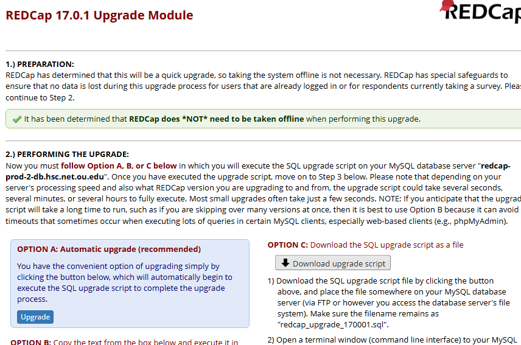
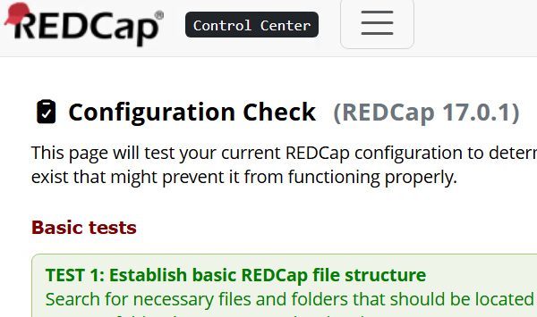

# Upgrade REDCap Version {#sec-adminser-upgrade}

**Chapter Leads**: Will Beasley

## Preparation {#sec-adminser-upgrade-prep}

### Release Cadence

For the reasons explained in @sec-adminser-security,
REDCap should be upgraded soon after versions are released.

A notification that a new version has been released will appear in
the control center.
So as the server administrator is attending to the TODO list periodically in the day,
they should check for updates as well.

However most regular releases occur Friday afternoons,
so your admin team should schedule time to upgrade the server
during this window.

Allowing for a minimal regiment of testing and validation (say, 15 minutes),
the following procedure should take about 30 minutes per server
after you've performed for it a few weeks.
It can be completed faster if you rush,
but we suggest blocking off at least 30 minutes
so you can be more observant and patient if something
doesn't look right.

### Avoid Easy Upgrade Feature

As of February 2026, best practices recommended _not_ using
the "Easy Upgrade" procedure.
See Community Post [272424](https://redcap.vumc.org/community/post.php?id=272424&comment=272776)
for further details.

### Offline vs Online Upgrade

Most upgrades require minor changes to the underlying MariaDB database,
and the developers do not recommend taking the server offline during the process.
However occasional upgrades are substantial enough,
and the Upgrade Module will recommend the administrator take the instance offline.
The warning appears in the "Obtain SQL Update Code" section.

In these cases, consider upgrading the nonproduction instance during the week,
and the production instance during the weekends or nights to minimize

### Version Skipping

#### Little Skips

If you upgrade every week, there won't be much opportunity to skip over versions,
say from 10.2.3 to 10.2.6.
Go ahead and make a small jump like this,
especially if the versions were released quickly in succession to address bugs.

#### Big Hops

However if your installation is months behind, say from 10.2.3 to 12.4.2,
the chance of an unhappy upgrade increases.
Not only is more PHP code changing,
which is interacting with external components like LDAP or FHIR,
but the MariaDB database structure is changing more too.

So given the larger risks of big hops we recommend:

1. Upgrading and validating the non-production instances first.
1. Taking the production instance offline.
1. Upgrading only ~3 months of versions at a time.
1. Snapshotting before each jump (and don't delete them until the entire upgrade process is complete)
1. Validating after each jump.

### OS Updates

Consider checking if your OS and related packages are up-to-date.
On RHEL, use the `dnf` command.

```bash
sudo dnf upgrade
```

## Test and Production Instances

The steps above pertain to updating a single instance of REDCap.
In addition to your _production_ instance,
we strongly suggest you host a _test_ or _development_ too.
^[The distinction between a test instance and development instance
is important to some aspects of server administration,
but not to this aspect.
Update all the nonproduction servers you have before your production servers.]
If so, perform these steps on the non-production server
and verify things operate correctly
to minimize the chance the research will be disrupted
when you upgrade the production instance.

## Steps

### Snapshot VM {#sec-adminser-snapshot}

In addition to any MariaDB-level backup,
we recommend taking a snapshot immediately before upgrading.
This should involve a snapshot of both
the database server and the web server.

For cost and performance considerations,
we typically retain only the most recent snapshot of each server.

### Download

Log into the REDCap Community site and download the latest version.
Make sure you select the correct value among these three dimensions:
(i) LTS vs Standard,
(ii) "Update" (as opposed to the "Fresh Installation"), and
(iii) version number.

### Transfer file

Transfer the zipped file from your client machine to the web server,
using a tool like [WinSCP](https://winscp.net/).
For this scenario, say it's transferred to the "Downloads/upgrades" directory
of the user's home directory.

### Update Web Server

The first component to be upgraded is the PHP code residing on the web server,
so log into the web server.

Decompressed the files and
move them to the appropriate REDCap folder
where they are visible and available to users.

On a Linux distribution like RHEL, the code is:

```bash
# Delete any 'redcap' directory unzipped from previous upgrades
cd ~/Downloads/upgrades
rm -rf redcap

# Unzip the file into a directory.
# If sudo is required, you're probably in the wrong directory
# If you unzipped previous versions, you'll be asked to override
# * Upgrade_Instructions.txt and
# * REDCap_License.txt.
unzip ~/Downloads/upgrades/redcap*_upgrade.zip

# Move the directory to a redcap subdirectory.
sudo mv ~/Downloads/upgrades/redcap/redcap_v*/ /var/www/html/redcap/

# Verify it was moved to the correct location.
cd /var/www/html/redcap/

# Should see the new directory, as well as the existing one
ls
```

### Obtain SQL Update Code

The second component to upgrade is the database,
which involves executing SQL code that
REDCap's installation process provides you.

After moving the PHP code, go to `<redcap-installation>/<redcap_version>/ControlCenter/`,
from your desktop.
Near the top of the page,
click a green banner proclaiming something like,
"Ready to upgrade to REDCap 12.3.4! Click here to navigate to the REDCap upgrade page."

This will take you to the "Upgrade Module",
which should indicate that the previous step was successful and provide SQL code.
Choose "Option C: Download the SQL upgrade script as a file"
to save the code as a sql file to your desktop machine
along the lines of "redcap_upgrade_120304.sql".

{width=80%}

Transfer the file from your desktop to the _database_ server,
specifically `~/redcap-upgrades`.
For the sake of consistency,
use the same approach as you transferred the PHP code to the web server in the previous step.[^sql-transfer]

[^sql-transfer]:
  It may be possible to copy the code from the web page and
  paste it into the database IDE,
  but we prefer the proposed approach for two reasons:

    1. The sql file helps document changes
       if you need to reconstruct something.

    1. It's tricky moving the code across machines if
       the Linux server-client protocol doesn't support
       copy-paste operations.

### Update Database Server

Log into the database server and open a database IDE.
Open the new upgrade sql file.^[[MySQL Workbench](https://www.mysql.com/products/workbench/)
and [phpMyAdmin](https://www.phpmyadmin.net/)
are popular tools for MariaDB/MySQL databases.
Our slight preference is [DBeaver](https://dbeaver.io/).]
Execute the entire file.

Although the entire file should be executed eventually,
but you can chose either line-by-line or all-at-once.
If it's a small hop between versions and the upgrade went smoothly
on the non-production instance,
consider making your life easier and hitting the Run button just once.

However if there were previous problems, we recommend a more conservative approach.
Possibly there were problems upgrading the non-production instance.
Or perhaps that ran smoothly, but the production upgrade failed,
so you rolled back to your VM snapshot.
Run small snippets of the code individually.
This incremental approach will help you identify where the code failed,
and therefore be more suggestive how to solve the problem.

::: {.callout-note appearance="simple"}

#### Database Context

You don't need to learn SQL to upgrade REDCap,
but a little understanding of the process
could help if the process doesn't go smoothly.

All upgrades will involve a least one line of
[DML SQL](https://www.datacamp.com/tutorial/sql-dml-commands-mastering-data-manipulation-in-sql)
code that adjust configuration values,
like the one that increases `redcap_version`.

More substantial upgrades involve
[DDL SQL](https://www.dbvis.com/thetable/sql-ddl-the-definitive-guide-on-data-definition-language/)
code that modifies the structure of the database,
like adding a table to support a new feature.
:::

### Verify Installation

#### Configuration Check

After updating the database, the Upgrade Module will redirect to the Configuration Check.
Inspect that all the "Basic" and "Secondary" tests pass.

{width=80%}

#### Test and Validate

The next step should be to follow your institution's procedure for testing
the instance again.
Furthermore, we recommend reading the ChangeLog on the Community site,
and focusing on any new features within the release.

For example, if some features or fixes involve the
Clinical Data Interoperability Services (CDIS),
check that the basic FHIR operations are performing as you expect.

### Clean Up

1. Delete Previous Versions

```bash
# Be very careful that you specify the *previous/old* version(s) correctly.
sudo rm -rf /var/www/html/redcap/redcap_v12.1.2
```

::: {.callout-note appearance="simple"}

## Additional Chapter Details

This chapter was started in March 2026.
If you have suggested modifications or additions, please see [How to Contribute](../index.qmd#sec-welcome-contribute) on the book's welcome page.
:::
