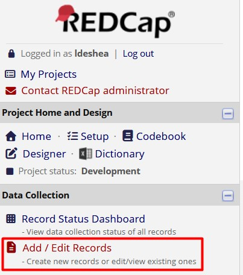
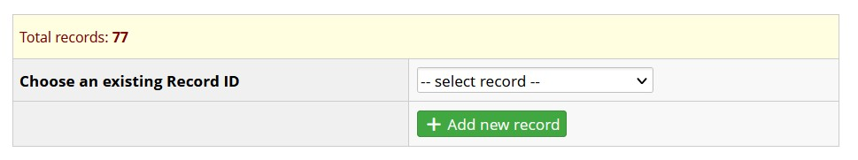
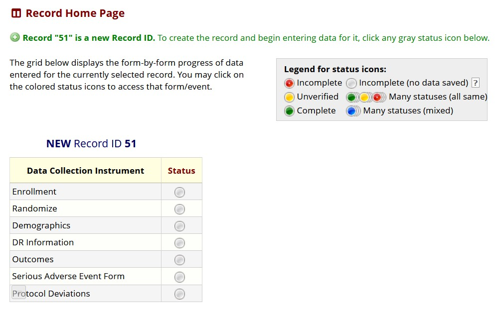
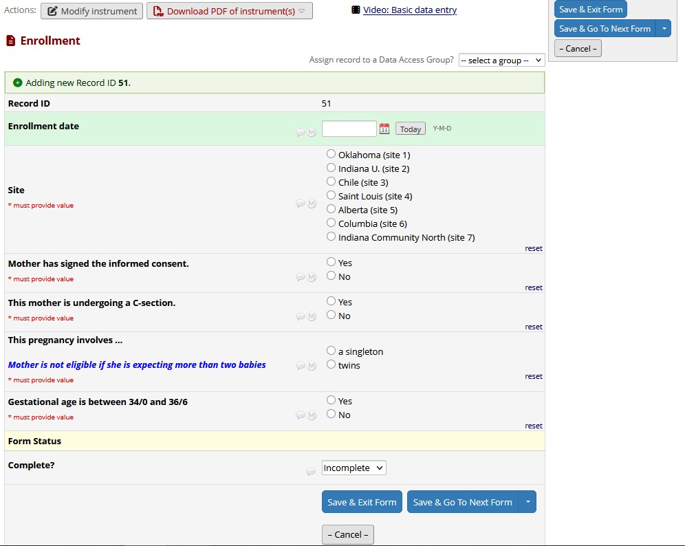
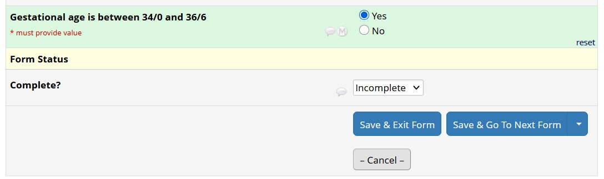
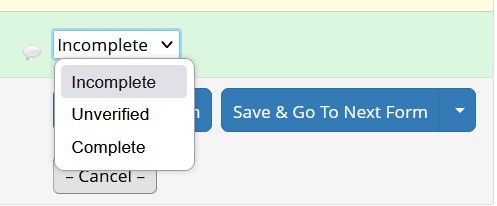
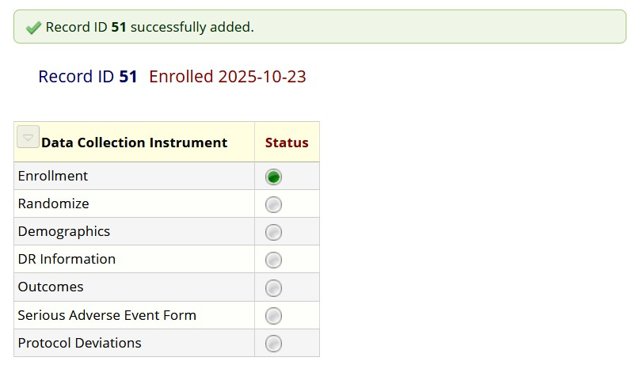
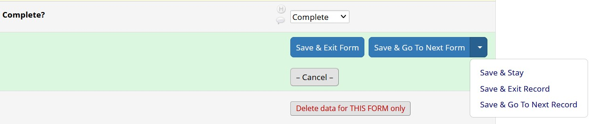
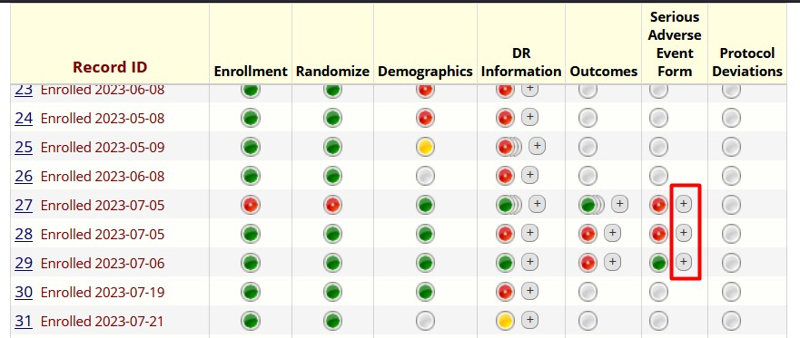
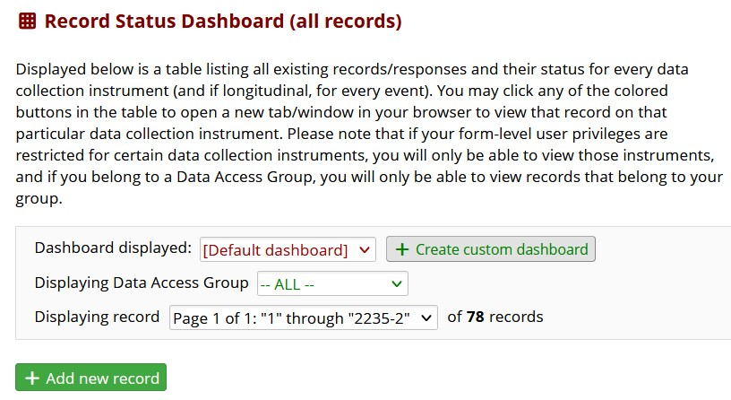

# Creating Records {#sec-begin-create}

<!--comment-->
<!--two # = 2nd level heading-->

**Chapter Leads**: Lise DeShea & Thomas Wilson

## What is a record? {#sec-begin-create-definerecord}

Creating records is analogous to taking out a copy of a form and starting to fill it out.
In REDCap, forms (also called instruments) are nested within projects.
A record is all the information in REDCap about one entity, like one participant in a study
or one person who completed a survey.
Someone filling out an online survey that was created in REDCap would create a record by completing the survey.
You might create a 
record while testing a project while the project is being developed. 
Or you might create a record after the project has been
put into production and data collection has begun for a study or investigation.

This chapter will show screenshots from a REDCap project that was created for the purpose of
letting data entry people practice.
It is an exact copy of another REDCap project that was used by people entering data from a multi-site 
randomized controlled trial.
The screenshots will not show any protected health information (PHI); all information you may see is
pretend data made up by the people learning how to use the practice REDCap project.
After they had practiced, their access to the practice project was turned off,
and they were allowed access to the study's actual REDCap for entering patient data.

## Creating a record {#sec-begin-create-createrecord}

After you have opened a REDCap project, you will see several links on the left side of the 
screen.
One of them is labeled *Add/Edit Records*:

{width=80%}

Clicking the Add/Edit Records link typically opens a screen where the new record is created.
This screen also assigns a unique identifying number to each record.
Look for a green button 
labeled *Add new record*:

{width=80%}

After clicking that button, we see the *Record Home Page* for the new record:

{width=80%}

This page summarizes the status of the forms for Record ID 51.
We see a list of 7 instruments.
The gray circles to the right of each instrument is a link to that instrument.
Notice the *Legend for status icons* box.
It shows different colors of circles. A gray circle means the 
form has no data saved in it.

## Entering a record {#sec-begin-create-enterrecord}

The Record Home Page is like a folder in which a clinic 
would keep all the forms for a given patient -- except everything is blank, and all we have
is a patient number (Record ID 51).
We have created a record, but we need to go into each 
instrument to enter data.
When we click on the gray dot next to the first instrument under 
*Data Collection Instrument*, we are taken to the Enrollment form for this project.

{width=80%}

After filling out the form for the 51st mother in this study, we come to the *Form Status*
section:

{width=80%}

This field has a drop-down menu.
By clicking on the downward-pointing arrowhead next to the
Incomplete, we see the menu of options:

{width=80%}

If all the information has been included in this form, you will select Complete. 
The Incomplete option is good for situations where the form has fields for information
that has to be entered later.
Unverified can be used for special situations in a study,
such as an investigator needing to check a data entry person's interpretation of an X-ray. 
Whatever status you choose will determine which color
of button will be shown on the Record Status Dashboard.
For this example, we will select 
Complete and click the blue button for *Save & Exit Form.* REDCap next will return you to the 
*Record Home Page*.

{width=80%}

Now the button next to Enrollment is green, which the Legend for status icons tells us
is Complete.
We can repeat this process for each of the other forms.
In fact, we can go from 
saving one form directly into the next form.

## Navigate from one record to another {#sec-begin-create-jumprecords}

By clicking the green button next to Enrollment,
we go back into Record ID 51's Enrollment form.
At the bottom of the page, the blue button
labeled *Save & Go To Next Form* has a drop-down menu with three options:

{width=80%}

*Save & Stay* stores the entered data but leaves the form open on your screen.
*Save & Exit Record* 
does the same thing as the blue *Save & Exit* button: it returns us to the Record Home Page.
*Save & Go To Next Record* would take us to Record 52, if it existed in this project.
Clicking on the blue *Save & Go To Next Form* button keeps us in Record 51 and opens the
next instrument in the project.

## Repeating instances of a form {#sec-begin-create-repeatinstance}

Sometimes forms are set up as repeating instruments, meaning it can be completed more than one for the same person.
In this practice project, the study 
allowed twins to be enrolled.
The initial Enrollment form pertained to the mother, but the 
DR (Delivery Room) Information form is a repeating instrument, which the data entry person
completes once for each twin.
After all, the twins will have different birth weights and
may receive different kinds of respiratory support.

Let's look at a list of the records already created for this project.
We will click the 
Record Status Dashboard link on the left side of the page, shown in the first screenshot 
in this chapter.
This dashboard shows different forms with different statuses, and to the right of 
some of the circles, there is a plus sign in a little gray box.
We have drawn a box around three of these plus signs.

{width=80%}

The plus sign is a link to create another instance (copy) of that form.
We might want to do 
that if the form has been filled out for one twin and we were ready to complete the instrument
for the other twin.

## Other ways to add records {#sec-begin-create-addrecord2}

New records can be created at least two other ways.
The Record Status Dashboard  has a green button labeled *Add new record*.
That is another avenue for creating a record.

{width=80%}

A new record also can be created when someone completes a REDCap survey.
Those records would
appear under the Record Status Dashboard.
Our example project does not involve surveys.

::: {.callout-note appearance="simple"}

## Additional Chapter Details

This chapter was last edited in October 2025.
If you have suggested modifications or additions, please see [How to Contribute](../index.qmd#sec-welcome-contribute) on the book's welcome page.
:::
