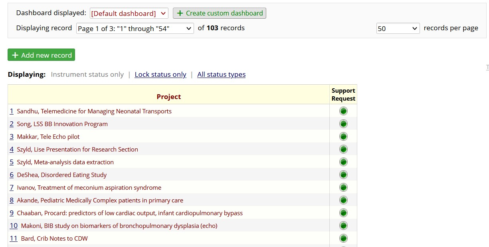
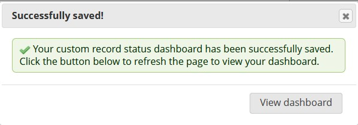

# Record Status Dashboard {#sec-begin-dashboard}

**Chapter Leads**: Lise DeShea and Thomas Wilson

## Purpose {#sec-begin-dashboard-purpose}

Imagine you are in a building with several floors.
You want to know about all the offices
in the building.
Where might you look?
One place you could look is near the elevator, where
you often will find a directory listing everyone with offices in the building.

That directory is similar to the Record Status Dashboard within a REDCap project.
When you want to find all the records in a project, you can navigate to the Record
Status Dashboard by going into the project and following the link on the left side of your screen.

{width=80%}

When you click the link, you see a summary of all the records in the project.
What is a record?
It's where all the information is kept about a specific person
or entity on which data are collected.
For our
example project illustrated here, there are only three records and three forms:

{width=80%}

## A more complex dashboard {#sec-begin-dashboard-complex}

Let's look at a dashboard with many more records.
Will all of them show up on one page?
It depends.
Take a look at the screenshot below. (FYI, no private health information, PHI,
will appear in these screenshots.)

{width=80%}

It appears there are 103 records in the project, and this screen is showing the first of
three pages of records.
The drop-down menu at the right shows the page was set
to display 50 records at a time.
But the "Displaying record" field shows the records
are numbered 1 through 54.
That is because the creator of this project deleted a few records.
The drop-down menu on the right can be set to show all records in the project.

## Parsing the dashboard {#sec-begin-dashboard-parsing}

What else can we learn from this page?
Well, the first column of the table is labeled Project.
The purpose of this REDCap project is to track the status of all research projects that
involve a specific statistician at OUHC; she created the REDCap to make notes on the
status of all active projects.
The column label, Project, is the label on the record
number.
As you recall, a record is where we save all the information about a specific
person or entity.
Here, the entity is the name of the project.
So "Record ID" was changed
to "Project" to be more descriptive for the user who is tracking many research projects.

By default, nothing is shown but the number, as we see in the second
screenshot on this page.
With this study tracking REDCap, the first column
has the number assigned to each research project, as well as the name of the
research project.
Displaying the name of the research project is a
customization of this REDCap project.
On another project, you might want the
customization to show the date that a patient enrolled in a study, or some other
data point that was collected.

## Customizing Records {#sec-begin-dashboard-customizingrecords}

Here is how to customize what is shown next to the
record ID.
On the left side of the screen, look for the link called *Setup*.

{width=40%}

Then look for the button that says *Additional customizations*.

{width=80%}

Clicking that button opens a window, with the first customization option being
*Set a Custom Record Label*.

{width=80%}

In the box labeled Custom Record Label, you can see that two variable names have
been listed inside square brackets, `[last_name_primary_contact]` and `[project_name]`, with a comma
and a space between the variable names.
Any words typed that are not variable names
inside square brackets also can be typed there.
After you have decided on your custom label
for each record, click Save and go back to the Record Status Dashboard to see how
the custom label looks.

Each record on the Dashboard has a Record ID, usually a number automatically assigned
by REDCap.
Each number is a link to that record.
The REDCap that tracks research studies
has another link on the same row.
Look for the column labeled
Support Request.
That is the only instrument in this project.
As researchers request
the statistician's services, information is collected about that request.
The green
circles in the Support Request column are links to each project.

## Navigating a record's homepage {#sec-begin-dashboard-homepage}

Clicking the record number takes you to the *Record Home Page*.

{width=80%}

The legend in the top
right of the following screenshot tells us the meaning of the Status circle's color.
A green
circle, or button, means the record has been saved as complete.
Clicking the green button
takes us into the form for this research project.
Let's look at where the button's color was
determined.
Look for the word Complete at the bottom of the form; that setting is responsible
for the button's color.

{width=80%}

## Buttons on a dashboard {#sec-begin-dashboard-homepage}

Let's take a look at a more complicated REDCap project with many instruments.
The project we will examine was created for data entry people in a certain research study
to practice entering data in a REDCap project identical to the one that was going
to be used to collect actual data from patients.
This practice project has made-up data.

{width=80%}

The first column of this dashboard is labeled Record ID, the default name used by REDCap
for assigning unique record numbers to each patient or entity for data collection.
This column also has the word "Enrolled" followed by a date.
This information was
specified as an additional customization.
This study had seven instruments: Enrollment,
Randomize, Demographics, DR Information, Outcomes, Serious Adverse Event Form, and
Protocol Deviations.
Now we see many colors of buttons.
The legend tells use red means Incomplete,
yellow means Unverified, green means Complete, gray means no data was saved on that form
for that patient, and overlapping buttons mean there is more than one copy of that form
saved in the project.
Blue overlapping buttons mean the multiple copies of the form
have different statuses.
If the overlapping buttons are red, yellow, or green, the multiple
copies have the same status, as indicated by the color.

## Repeated instances of a form {#sec-begin-dashboard-repeated}

When would you have multiple copies of the same form?
Let's use this REDCap project
as an example.
The study involved enrolling those who were about to have a baby.
Those expecting twins could participate in the study.
Once the twins were born,
data were collected about each twin separately -- birth weight, kind of respiratory support
given immediately after birth, etc.

Suppose you have entered the data on the first twin and you need to enter data about
the second twin.
You would find the row for that mother, go to a form you needed to complete
about what happened to the second twin in the delivery room (the DR Information form), and look
for the plus sign in the gray box.

{width=80%}

Clicking that plus sign creates another copy of the same DR Information form and is a link
to that copy.
Data entry can proceed from there.

## Customizing the dashboard {#sec-begin-dashboard-customizindashboard}

The Record Status Dashboard can be used to create custom dashboards as well.
Look
for the box toward the top of the page.

{width=80%}

Clicking that box opens a form for creating the custom dashboard.

{width=80%}

Suppose we want to create a dashboard that shows data only for the mothers who
signed up in Oklahoma for this multi-site study.
We will need the record number,
plus the instruments called Enrollment and Demographics.
We can click on the little
pencil icon next to *Select instruments* and specify those instruments.

{width=80%}

Then we can create filter logic that gives a statement that must be true in order
to get only the records we want.
In this example, we need the variable called site to
equal Oklahoma.
When we click in the *Filter logic* box, we get a *Logic Editor* window where the logical
statement is written.

{width=80%}

The name of the variable is in square brackets, then there is an equals sign, then the
value that we want site to equal: Oklahoma.
But notice: in this project, Oklahoma is the *label*
for the site; it is not the data point that is saved in REDCap.
In this project,
the label Oklahoma was assigned to the number 1. The logic editor must give the data
value, not the label Oklahoma.
We click "Update & Close Editor," then we
click the blue button that says *Save dashboard*.

{width=80%}

We get a message that the custom dashboard was saved, and we can click the gray button
that says *View dashboard*.

{width=80%}

Then we will see the custom dashboard that we created.

{width=80%}

## Troubleshooting {#sec-begin-dashboard-trouble}

### Can't see all your records? {#sec-begin-dashboard-trouble-notallrecords}

If you ever look in your REDCap project and can't see all your records, check the settings
at the top of the Record Status Dashboard and see if you have navigated to a custom
dashboard that shows only some of the records.
You can switch dashboards by using the drop-down
menu toward the top of the page and selecting *Default dashboard*.

{width=80%}

::: {.callout-note appearance="simple"}

## Additional Chapter Details

This chapter was last edited in October 2025.
If you have suggested modifications or additions, please see [How to Contribute](../index.qmd#sec-welcome-contribute) on the book's welcome page.
:::
