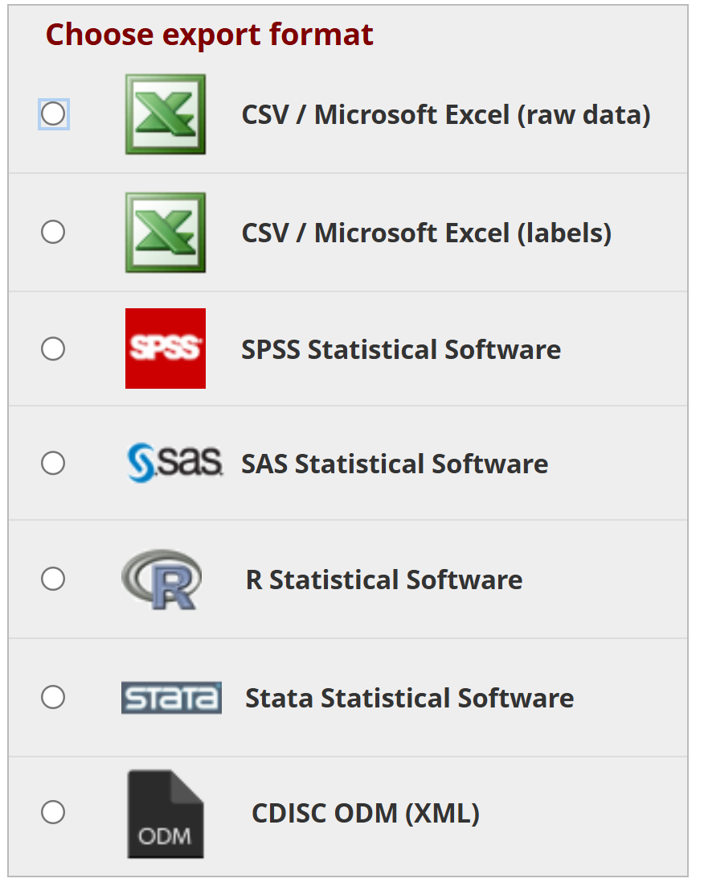

# 21 CFR Part 11 Requirements of the Researcher {#sec-check-part11}

**Chapter Leads**: Thomas Wilson

Glossary:

* _RA_: REDCap Administrators.
  OU employees that are responsible for the overall instance on campus.
  This includes some [OCRI](https://research.ouhsc.edu/ocri) employees (like Thomas Wilson)
  train users and manage the back-end servers.
  It also includes OU IT employees who are experts in virtual servers and Linux.

* _RD_: REDCap Developer. Vandy {Come back to this.}

* _RT_: Research Team.
  These are the people managing the research project.
  Their typical duties include designing the study, collecting data, analyzing the results, and publishing the findings.

  These are the individuals who are responsible for the daily operations of the study,
  and how a study is reflected in a REDCap project.

  The RT is different from the people who design the REDCap software (at Vanderbilt University) and
  from the people who administer the local REDCap instance (in OCRI and OU IT).

## System Validation And Change Control (Sec A) {#sec-check-part11-system}

RTs are not responsible for content in this section.

## Access Control And Security (Sec B) {#sec-check-part11-access}

### User Authentication (Subsec B1) {#sec-check-part11-access-authentication}

RTs are not responsible for content in this section.

### Role-Based Permissions (Subsec B2) {#sec-check-part11-access-role}

#### Are roles and permissions in REDCap configured to ensure that users only have the minimum necessary access to perform their job functions? {#sec-check-part11-access-role-minimum}

REDCap allows fine-grained permissions to users and groups within each project.

It is the RT's responsibility to assign other study team members the appropriate permissions,
while following the principles of [least privilege](https://en.wikipedia.org/wiki/Principle_of_least_privilege).

#### Are permission sets periodically reviewed to confirm they still align with user job functions? {#sec-check-part11-access-role-periodically}

Yes, the REDCap dashboard to allow someone to quickly review the study's users, groups, and permissions.
It is the RT's responsibility to periodically review this dashboard.

#### Do you enforce the principle of least privilege (admins vs. data entry vs. monitors)? {#sec-check-part11-access-role-least}

The RT works with their team members and should be aware of their roles approved by the IRB.

It is the RT's responsibility to assign the appropriate levels of privileges.

### Account Provisioning and Deprivisioning (Subsec B3) {#sec-check-part11-role-privisioning}

#### Is there a clear process to grant, modify, or revoke system access when personnel changes roles or leave the organization? {#sec-check-part11-role-privisioning-access}

Yes, the REDCap user rights dashboard allows RT staff to easily grant, modify, or revoke system access when personnel changes occur.

It is the RT's responsibility to monitor staff changes and make the appropriate system access modifications when necessary.

#### Must accounts be removed within a certain time frame (e.g., 24 hours) after staff departure {#sec-check-part11-role-privisioning-departure}

Yes, REDCap allows for the expedient removal of staff from the appropriate REDCap projects..

It is the RT's responsibility to monitor staff changes and remove accounts from the projects. 

#### Do new users undergo formal training or competency checks before access is granted? {#sec-check-part11-role-privisioning-training}

Yes, the RA team provides general REDCap training on how to operate the system.  The RT will be responsible for training and competency check for the specific project that new staff will be using.

### Audit Trail Review (Subsec C3) {#sec-check-part11-audit-trail}

#### Is there a process for periodically reviewing audit trails and investigating any anomalies? {#sec-check-part11-audit-trail-review}

Yes, REDCap maintains an audit log for all transactions within a specific project.  It is easily accessible and downloadable as a .csv file.

It is the responsibility of the RT to review the audit logs and investigate any anomalies.

#### Is there a routine schedule (monthly, quarterly) for audit trail reviews? {#sec-check-part11-audit-trail-schedule}

With the accessibility of the REDCap audit log, scheduling of reviews can be done at any appropriate schedule.

It is the responsibility of the RT to schedule the audit trail reviews.

#### Who is responsible for these reviews, and are they qualified to interpret logs? {#sec-check-part11-audit-trail-responsibility}

REDCap maintains the audit log in an accessible and downloadable format. 

The RT is responsible for assigned the reviewer and determining their qualification to interpret the logs.  

#### Do you conduct forensic reviews if suspicious activity is detected? {#sec-check-part11-audit-trail-forensicreview}

The RT is responsible for conducting forensic reviews if suspicious activity is detected.

### Data Entry and Validation Checks (Subsec C4) {#sec-check-part11-dataentry-validation}

#### Do you conduct forensic reviews if suspicious activity is detected? {#sec-check-part11-dataentry-validation-preventerrors}

Yes, REDCap allows data fields to be configured with multiple data validation rules.  These rules include format checks, ranges for dates
and numeric entries, required fields, and designating that a field is an identifier.  REDCap also utilizes functionality called "Action Tags"
to further ensure that data are collected in an accurate efficient manner.  The RA team can train the RT on all of these features,
but it is the responsibility of the RT to implement the features into their projects.

#### How do you handle data corrections or errors (formal data query, edit check process? {#sec-check-part11-dataentry-validation-corrections}

REDCap allows for users with appropriate permissions to correct data or errors within a project.  Any changes to the data are recorded in
the REDCap audit log.  Additionally, REDCap has a field comment log for each for field.  The field comment log allows users to
record the reason they are making a modification to the data for each field that needs to be corrected.

It is the responsibilty of the RT to make data corrections or address errors.

## Record Retention (Sec G) {#sec-check-part11-retention}

### Long-Term Accessibility (Subsec G2) {#sec-check-part11-retention-accessibility}

#### Are file formats chosen to ensure long-term readability (e.g., PDF, CSV)?{#sec-check-part11-retention-accessibility-longterm}

REDCap provides the export formats shown in @fig-check-part11-200-export-formats,
ranging from the highly-portable (_e.g._, .csv: comma separate value)
to the specialized and proprietary (_e.g._, .sas7bdat: SAS files).

To promote portability and long-term usefulness,
we recommend exporting data as a csv.
Even if you want something specialized in the short-term (_e.g._, an SPSS file),
we recommend exporting and storing second copy (as a csv) to improve the options available
to others in the future.

{#fig-check-part11-200-export-formats width=50% fig-alt="Data Export Formats"}
