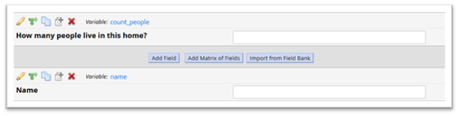

# Checklist for Testing a REDCap Project {#sec-check-testing}

**Chapter Leads**: Lise DeShea

Congratulations on completing your REDCap project!
When someone requests a REDCap project to be moved into production
(_i.e., to go live for data collection_)
the REDCap Administrator must ask: Has this project been adequately tested?
Just as a company will test a new product and all of its parts before going into mass production,
your REDCap project needs to be well-tested before going live.

Thoroughly testing your REDCap project before going live is important **because you can lose data**
if you make changes to the survey/form after data collection has begun.
If skip patterns are not correct, necessary questions can be skipped or data may be collected that is not required.
If the question format is not correct, it may be difficult to analyze after data collection ends.

_Why do we tell project developers to try to break their REDCap project?_

Breaking a project means testing your survey from a perspective of a naïve user who knows nothing about the project's purpose or the data being collected. You need to think of all the ways the project could fail or be misunderstood, and try to make that happen. We created this checklist to guide your REDCap testing:

## Before sending your instruments or survey for testing, the designer (you) will need to: {#sec-check-testing-before}

### Check the field type for every variable {#sec-check-testing-before-type}

Make sure the field type is what you had meant to select. For instance, is the date field using the correct validation, such as MM/DD/YYYY? Does a multiple-choice item allow only one response? If so, then it needs to be a radio button. A checkbox field allows multiple responses to be chosen on a multiple-choice item.

### Use clear language {#sec-check-testing-before-language}

* Many surveys/instruments are completed or used by people of different literacy levels or for whom English is a second language, so it is crucial to be as clear as possible.
* Make sure labels are clear and the logic between items is easy to follow. Vague labels and difficult-to-follow logic can lead to items being skipped and data to be missing, or incorrect responses may be entered. Example:

{#fig-check-testing-010-name fig-alt="Name"}

Whose name? The person filling out the form? Their first name? Last name? The last name of a family in the home? What if they have different last names? The survey might be clear to the person creating the project, but a second or third set of eyes may catch items that are unclear.

### Inspect each field and think about what the data will look like for the person eventually analyzing the data {#sec-check-testing-before-analysis}

Example:

With a fill-in-the-blank text field like the one above, here are some of the ways that someone may report a birthday:

```csv
January 8, 1999    08 January 1999    Jan 8, 99   1-8-1999
Jan. 8, 1999      jan 8 1999          1999-1-8    8 Jan ‘99
```

A subsequent analysis would report there were 8 different dates entered, instead of 8 people with the same birth date.
And forget about being able to calculate someone's current age based on these data! Use REDCap's built-in data validation capability whenever possible.
Go through your items and figure out if you can validate each field in some way.
Even something like "Child's age" could be entered numerous ways in a free-text field:

```csv
Seven    7 years old        Don't know      8 on his next birthday
7        7 years, 4 months  I don't know
```

You might modify your item to specify "Child's age (in years)" and use data validation to require the person to enter an integer.

### Check whether your project is failing to collect necessary data, either by fields not being completed or fields being left off the form  {#sec-check-testing-before-necessary}

* Go back to the original plan for the project and check your work.
* What was the purpose of the project? Did every needed field get included in your instruments/survey?
* Will the fields in your instruments/survey collect the information required to to fulfill the needs that motivated the project?

### Test the survey yourself {#sec-check-testing-before-yourself}

* Many times, omissions or errors can be found by testing the survey/instrument yourself.
* Enter test data. If you are testing a survey, follow along with the paper survey and see if it matches with what is in REDCap.
* Review the data you just entered and see if the data is what you expected.

## When you decide you are ready to have individuals enter test data on your instrument or survey, select the individual(s) that you want to test your project {#sec-check-testing-others}

### Have at least one other person enter test data in your instruments or survey. {#sec-check-testing-others-person}

* Sometimes the person creating the project is too close to it and can't see its limitations. A second, third or fourth set of eyes is crucial, and they can enter many test records with different scenarios in mind.
* Could any of the items be misunderstood by a naïve user?
* Check the data entered to see if the questions meet the goals of the project? Example:
  * If people with diabetes need to answer extra questions, has the branching logic been set up correctly so that those items only appear when someone says they have diabetes? Your tester(s) should enter data for different kinds of study participants. This step is important to complete before a project is moved into production because you may not be able to test changes in branching logic at a later point.
* Does the survey work equally well on a cell phone vs. a computer? Having multiple testers will allow testing on different platforms.
* Is there enough room in the text box for answers or do you need to change it to a notes box?

_Testing a public survey_

* Public surveys can be distributed from REDCap email or through an OU email with an embedded link.
  The tester's email address is required.
* If there is a paper survey, send selected individuals a copy and have them check to see if it matches what they see in REDCap.
  Other testers can test the survey without using the paper survey.

_Testing data collection forms that are not surveys_

* Testing data collection forms in REDCap (i.e., it is not a public survey),
  will need to be done by individuals within your group or by individuals who will have temporary access to the project
  for testing only. They will need to be removed from the project
  prior to pushing the project to production and prior to collecting data collection.

### Have at least one other person who is familiar with the study or investigation check whether the REDCap project matches any printed documents, like IRB protocols and approved procedures.   {#sec-check-testing-others-printed}

* Is the project accurate and staying within the bounds of what has been intended or IRB-approved?
* Is the wording correct on all instruments?
* Is everything spelled correctly?
* Is the skip logic correct? Does the skip logic match what is in the printed survey?
* Are all the items present?
* Have any items been added that were not approved by the IRB (and therefore should be deleted)?
* Are calculated variables producing correct answers?

### Ask the individuals testing your instruments/survey if the forms/surveys are user-friendly in its appearance {#sec-check-testing-others-appearance}

* Are the colors easy on the eyes?
* Are colors acceptable for people who are color-blind?
* If a team will be entering data directly into REDCap (i.e., it is not a public survey), are the instruments too long? Could the instrument be broken up into shorter instruments so the data entry person doesn't feel like they're working on the Great Wall of China?
* Could some items be put into a table using the rich text editor in a descriptive field? These tables can save space and require less scrolling by the data entry person. Ask your REDCap Administrator how to do that.

## When the testers have completed their testing {#sec-check-testing-completed}

### Make any necessary changes to the survey or data instrument. {#sec-check-testing-completed-necessary}

### Review suggested changes and make changes based on their feedback. {#sec-check-testing-completed-feedback}

### Look at the data that the testers entered into REDCap  {#sec-check-testing-completed-inspect}

* Does any of the  information look like it would be unusable or not as expected?
* Can the field be modified with data validation settings?
* Make corrections to the field if necessary.

### Are there any text boxes that need to be turned into notes fields? {#sec-check-testing-completed-notes}

## When you are satisfied that everything is perfect {#sec-check-testing-satisfied}

### Move your project to production status by (1) clicking on "Project Setup" tab:  {#sec-check-testing-satisfied-setup}

### Then scroll down, and (2) click on the button "Move project to production." {#sec-check-testing-satisfied-move}

### If you have real data entered and don't want to lose it, click on "Keep ALL data saved so far." {#sec-check-testing-satisfied-keep}

### If everything is test data, {#sec-check-testing-satisfied-fake}

  remember to click on "Delete ALL data in the project (including any survey responses), calendar events, documents uploaded onto forms/surveys,
  and all archived data export files stored in the File Repository, and any logged events that pertain to data collection."

### Click on the button "Yes, Request Admin to Move to Production Status."  {#sec-check-testing-satisfied-request}
