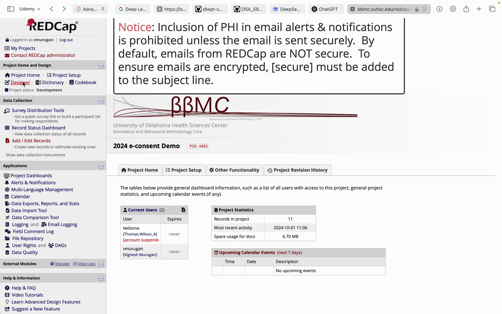
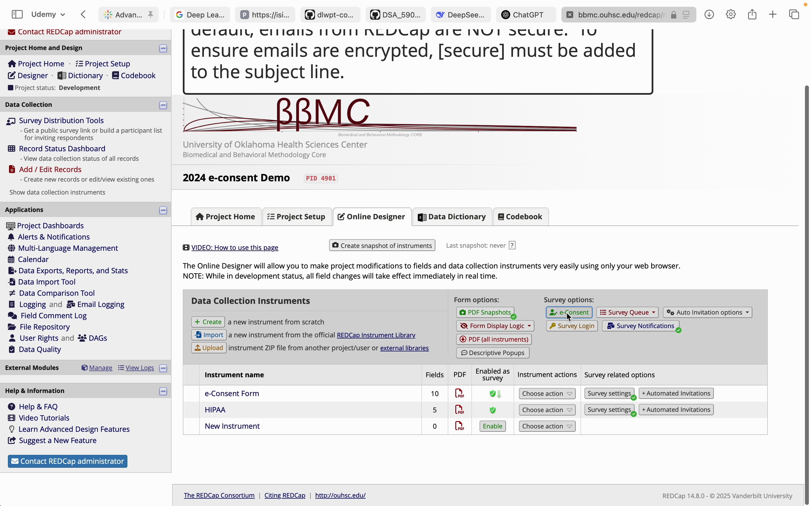
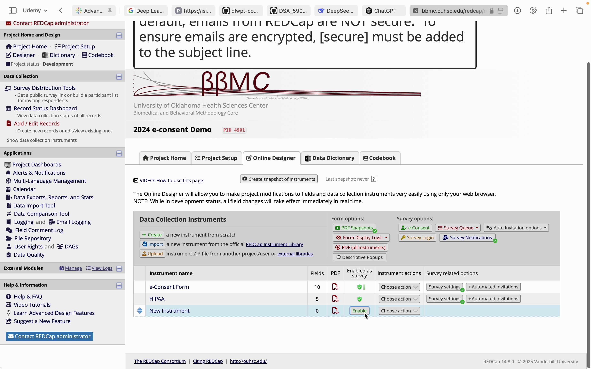
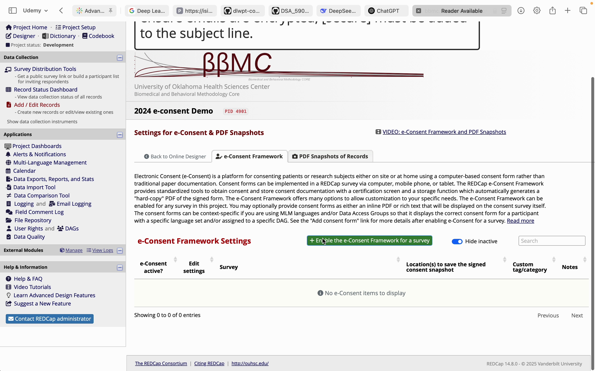
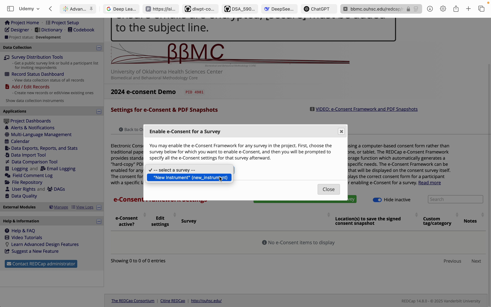
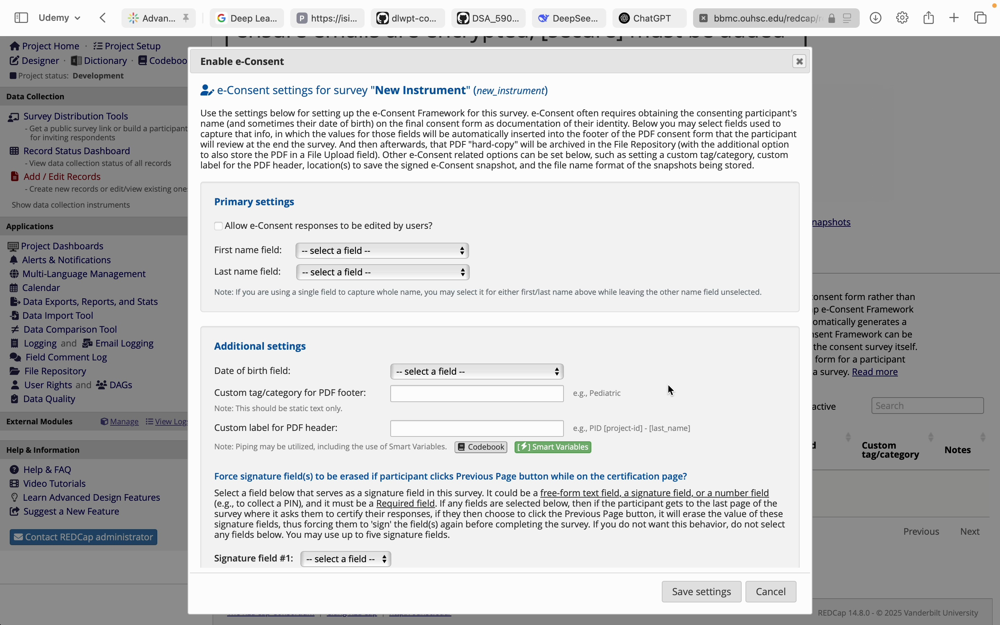

# Electronic Consent {#sec-designadv-econsent}

**Chapter Leads**: Vignesh Murugan, Thomas Wilson

::: {.callout-note appearance="simple"}

# How to Set Up an e-Consent Framework in REDCap

## Enabling the e-Consent Framework

1. Navigate to the **Online Designer**.  

   

   

## 2. Enable the e-Consent Framework for a Survey

   

## 3. Click on **e-Consent and PDF Snapshots** in the *Data Collection Instruments* header box

   

   

   

## Configuring Settings

### Primary Settings:
- Allow user edits and specify name fields.  

### Additional Settings:
- Add a **Date of Birth** field, custom headers/footers, and signature settings.  
- Specify save locations and customize file names.  

   

      
   

## Adding Consent Versions

1. Click **Add Consent Form**.  
2. Specify the version number and upload the consent form.  
3. Save the new version.  

## Additional Chapter Details

This chapter was started in October 2024.
If you have suggested modifications or additions, please see [How to Contribute](../index.qmd#sec-welcome-contribute) on the book's welcome page.
:::
