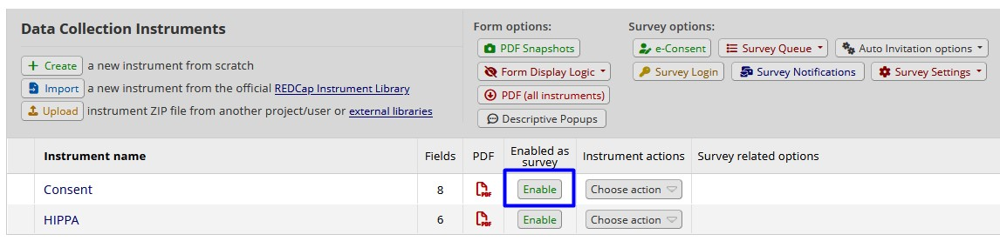
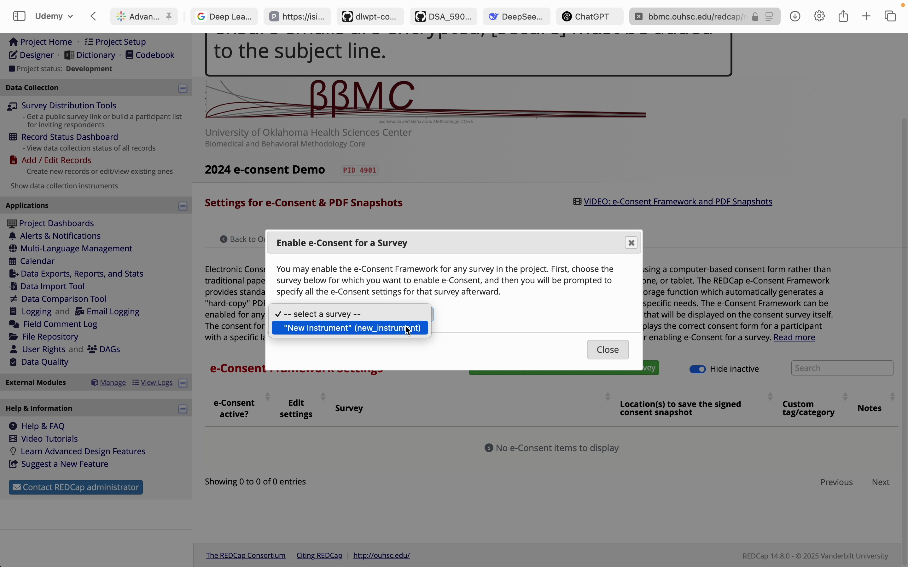
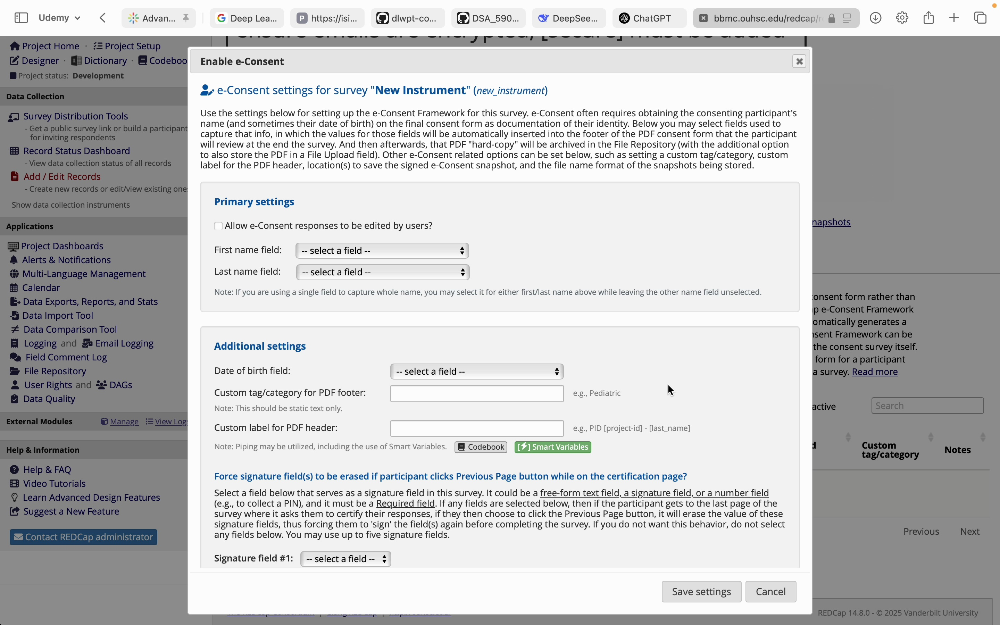

# Electronic Consent {#sec-designadv-econsent}

**Chapter Leads**: Vignesh Murugan, Thomas Wilson

## Enabling the e-Consent Framework

1. Navigate to the **Online Designer**.

   

      
   

   

      
   

1. Enable the e-Consent Framework for a Survey

   

      
   

1. Click on **e-Consent and PDF Snapshots** in the *Data Collection Instruments* header box

   

      
   

   

      
   

   

      
   

## Configuring Settings

### Primary Settings

- Allow user edits and specify name fields.

### Additional Settings

- Add a **Date of Birth** field, custom headers/footers, and signature settings.
- Specify save locations and customize file names.

   

      
   

## Adding Consent Versions

1. Click **Add Consent Form**.
1. Specify the version number and upload the consent form.
1. Save the new version.

::: {.callout-note appearance="simple"}

## Additional Chapter Details

This chapter was started in October 2024.
If you have suggested modifications or additions, please see [How to Contribute](../index.qmd#sec-welcome-contribute) on the book's welcome page.
:::
