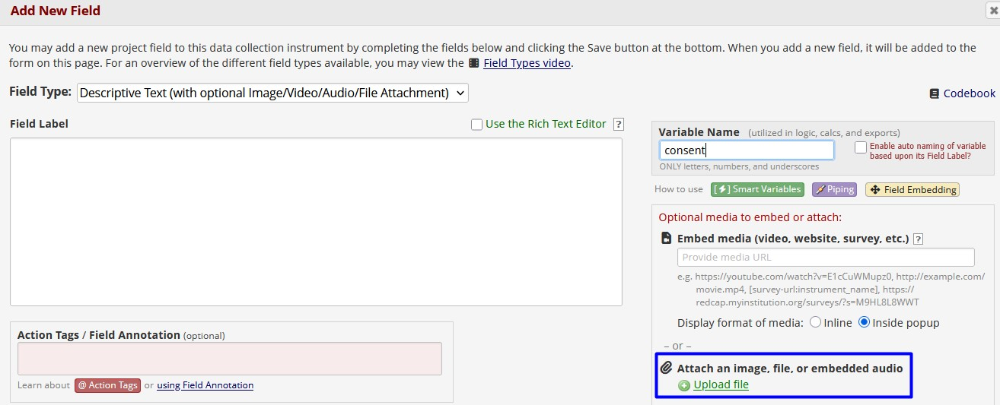
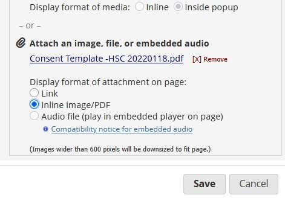

# Electronic Consent {#sec-designadv-econsent}

**Chapter Leads**: Vignesh Murugan, Lise DeShea, Thomas Wilson

## What is the Purpose of e-Consent? {#sec-designadv-purpose}

Many research studies conducted at the University of Oklahoma Health Campus involve obtaining participant consent.
The Institutional Review Board examines and approves the protocol for research studies involving people.
This approval includes a careful review of consent forms, which inform potential participants of their rights as well as the risks and benefits of participating in the study.
Researchers increasingly are using electronic consent forms.
The e-consent capability of REDCap provides the environment for collecting participants' informed consent via electronic forms. This chapter will lead you through the process of setting up an e-consent project.

## Request a New Project

For most studies we recommend having the e-consent process separate from any REDCap project created for the purpose of collecting participant data.
Data collection often is de-identified or has limited identifiers, such as a participant ID that the researchers link to the participants' identities in a secure file outside of REDCap.
Because participants are identified in consent forms, the e-consent should be in its own project.

To learn how to request a new project, see [Best Way to Learn](variable.md#sec-designbas-variable-howtolearn).

## Preparing to Build the e-Consent

You will need pdf copies of the researchers' *current* IRB-approved consent form and HIPAA form, which notifies potential participants of their rights to the privacy of their personal health information.
It often is a good idea to obtain a copy of the IRB-approved protocol as well, so that you are familiar with the study and the role of e-consent within the study.

To understand how the e-consent project will work, you should know that researchers typically email a link to an online survey containing the consent and HIPAA forms.
There is a field for the signature of the person obtaining the consent.
But the form is completed by the participant.
The person obtaining consent will have access to the REDCap project and will add his/her signature inside REDCap after the participant submits the online forms.

## Starting an e-Consent Project

1. Click on your list of projects at the top of the landing page for REDCap.
Click on the name of the e-consent project name.
1. Navigate to the **Online Designer** by clicking on either link shown in the blue boxes in the image below.
Clicking one of those links will take you to a screen that looks somewhat like the one in the second image below.

   {width="80%"}

   {width="80%"}

1. You will need two instruments: one for the consent form and one for the HIPAA form (if applicable).
Change the name of Form 1 to Consent by clicking on the gray button labeled *Choose actions" to the right of Form 1.
Select *Rename.*
Modify the information in the window that pops up, as shown below.
The first box is the name that will appear in Designer, and the second name is how the form will be referenced inside the REDCap data collection.
Once these changes are made, click *Apply.*
   {width="80%"}

1. Now create a new instrument called HIPAA by clicking on the button that says *Create.*

{width="80%"}

A green button will appear, as shown below. Click that button and enter *HIPAA* as the form name.

{width="80%"}

These two REDCap instruments will contain pdfs for the consent and HIPAA forms.
Next we will create the fields needed for these forms to allow completion within REDCap.

## Modifying the REDCap Instruments for Consent and HIPAA

We will be collecting signatures electronically.
The participants will not sign the pdf with a pen.
Therefore, we need to create fields in REDCap that the participants would have filled out in ink on a paper form.
The consent and HIPAA forms shown below are templates from the OUHC IRB.
Please ignore the old dates.

### Consent Form

1. Read the consent form and identify every field that a participant or researcher would have to complete.
Often the only fields that will need to be completed appear at the end of the document, although occasionally researchers will list medical tests that require the participant's initials.

1. Let's say participants in our example need to fill out only the fields shown below.

   {width="80%"}

1. In REDCap, click on Consent in Online Designer to get to the screen where we will create variables to replicate the fields shown above.
We will have the following fields and variable types:
- A signature field for the participant's signature
- A text variable for the participant's first name
- A text variable for the participant's last name -- separate name fields are required, even if they do not appear that way on the pdf form
- A date variable for the date of signature
- A signature field for the person obtaining consent
- A text variable for the printed name of the person obtaining consent
- A date variable for the consent obtainer's date of signature.
Other consent forms also may have fields for a witness to sign and for a child to sign indicating his or her assent.
(Children cannot sign a legal form granting consent; the parent or guardian must grant consent.
But obtaining assent from a child old enough to understand that s/he will be participating in a study is the ethical choice.)

1. Create the needed consent fields listed above.
Make sure the participant's signature is **required** by clicking that button when creating the field.

   {width="80%"}

   {width="80%"}

2. The project now has the parts of the consent form that need to be filled out.
But our REDCap project needs to provide the potential participant with the pdf of the consent form.
Create a new *Descriptive Text* variable at the top of the Consent instrument (after Record ID) by clicking the *Add Field* button, shown below.

   {width="80%"}

1. You won't put anything in the box called *Field Label.*
Name this variable *consent*, then click the link *Upload file* just below the sentence *Attach an image, file, or embedded audio*

   {width="80%"}

After you upload the pdf of the consent form, you will need to select *Inline image/PDF,* as shown below.

   {width="80%"}

### HIPAA Form

Now do the same thing for the HIPAA form:

- Identify all elements that would be filled out on a printed HIPAA form
- Go into the HIPAA instrument on REDCap and create those fields
- Be sure to include the Descriptive Field called hipaa and upload the HIPAA pdf, setting it to appear inline

## Enabling Surveys

Before the consent form can be designated as such in the e-consent framework (that is, the REDCap module for electronic consent), we must specify that the forms are on a survey.

### Tell REDCap to Allow Surveys

On the Project Setup tab, click the *Enable* button next to the words "Use surveys in this project."

   {width="80%"}

Return to Online Designer and click on the Enable button on the same line with the Consent form.

   {width="80%"}

You will be taken to a new screen where you will specify how the survey will look and perform.
We will illustrate only the most important details.

   {width="80%"}

Scroll down to Survey Theme. The default theme is black, white, and light blue.
A common choice for a theme at OU is Red Brick because the colors are similar to those of the university.
The investigators running your study may have a preference.

   {width="80%"}

Scroll down to *Survey Termination Options.*
Place a checkmark in the box *Auto-continue to the next survey.*

   {width="80%"}

Click the *Save Changes* button at the bottom of the page.
You will be taken back to Online Designer.
Now click the *Enable* button on the HIPAA line.
Select the Survey Theme to match the one you used on the conent form, then click Save Changes.

## Enable e-Consent Framework

Finally we can enable the e-Consent Framework, the module that was designed to handle electronic consenting processes.
In Online Designer we do that by clicking the *Enable* button under Survey Options, shown above the list of instruments.

   {width="80%"}

You will be taken to a page called *Settings for e-Consent & PDF Snapshots.*

   {width="80%"}

Click the big green button that says *Enable the e-Consent Framework for a survey.*
You will get a window that says *Enable e-Consent for a Survey.*
You will select Consent from the drop-down menu.

   {width="80%"}

Another window will open, called *Enable e-Consent.*
The first two 

2. Click on **e-Consent and PDF Snapshots** in the *Data Collection Instruments* header box

   {width="80%"}

   {width="80%"}

   {width="80%"}

## Configuring Settings

### Primary Settings

- Allow user edits and specify name fields.

### Additional Settings

- Add a **Date of Birth** field, custom headers/footers, and signature settings.
- Specify save locations and customize file names.

   {width="80%"}

## Updating Consent Forms

Studies with IRB oversight must check in periodically and inform the IRB about the study's status.
Among other tasks the researchers must obtain re-approval of their consent form.
When you create an e-consent project, it is a good idea to put a note on your Outlook calendar reminding you to check with the researchers before their consent form expires.
Then you will be better prepared to replace the consent and HIPAA forms with the latest versions, with the new expiration date given.

1. Notify the people who will be collecting the study's informed consent that you will be working on the e-consent on REDCap and that they should pause using the e-consent until you inform them the new forms have been uploaded
2. Go into Development Mode by such and such
3. Go *** and *** then do such and such
4. Click **Add Consent Form**
5. Specify the version number and upload the consent form
6. Save the new version
7. Ask for the project to be moved back into Production Mode
8. After being notified that the project is in production, go to the survey and create a test record by completing the forms, using a name like *Testing REDCap*
9. If everything is working correctly, notify those collecting informed consent that the e-consent REDCap is back in production with the new forms, and they may see a test record in REDCap

::: {.callout-note appearance="simple"}

## Additional Chapter Details

This chapter was last edited in April 2026.
If you have suggested modifications or additions, please see [How to Contribute](../index.qmd#sec-welcome-contribute) on the book's welcome page.
:::
