# Electronic Consent {#sec-designadv-econsent}

**Chapter Leads**: Lise DeShea, Vignesh Murugan, Thomas Wilson

## What is the Purpose of e-Consent? {#sec-designadv-purpose}

Many research studies conducted at the University of Oklahoma Health Campus involve obtaining participant consent.
The Institutional Review Board examines and approves the protocol for research studies involving people.
This approval includes a careful review of consent forms, which inform potential participants of their rights as well as the risks and benefits of participating in the study.
Researchers increasingly are using electronic consent forms.
The e-consent capability of REDCap provides the environment for collecting participants' informed consent via electronic forms. This chapter will lead you through the process of setting up an e-consent project.

## Request a New Project

For most studies we recommend having the e-consent process separate from any REDCap project created for the purpose of collecting participant data.
Data collection often is de-identified or has limited identifiers, such as a participant ID that the researchers link to the participants' identities in a secure file outside of REDCap.
Because participants are identified in consent forms, the e-consent should be in its own project.

To learn how to request a new project, see [Best Way to Learn](../designbas/variable.md#sec-designbas-variable-howtolearn).

## Preparing to Build the e-Consent

You will need pdf copies of the researchers' *current* IRB-approved consent form and HIPAA form, which notifies potential participants of their rights to the privacy of their personal health information.
It often is a good idea to obtain a copy of the IRB-approved protocol as well, so that you are familiar with the study and the role of e-consent within the study.

To understand how the e-consent project will work, you should know that researchers typically email a link to an online survey containing the consent and HIPAA forms.
There is a field for the signature of the person obtaining the consent.
But the form is completed by the participant.
The person obtaining consent will have access to the REDCap project and will add his/her signature inside REDCap after the participant submits the online forms.

## Starting an e-Consent Project

- Click on your list of projects at the top of the landing page for REDCap.
- Click on the e-consent project name.
- Navigate to the **Online Designer** by clicking on either link shown in the blue boxes in the image below.
- Clicking one of those links will take you to a screen that looks somewhat like the one in the second image below.

   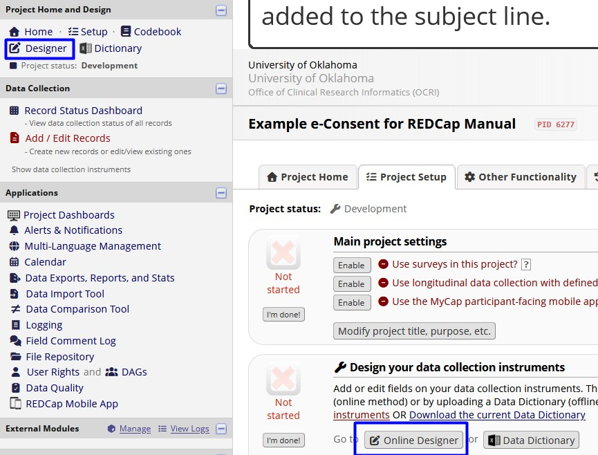{width="80%"}

   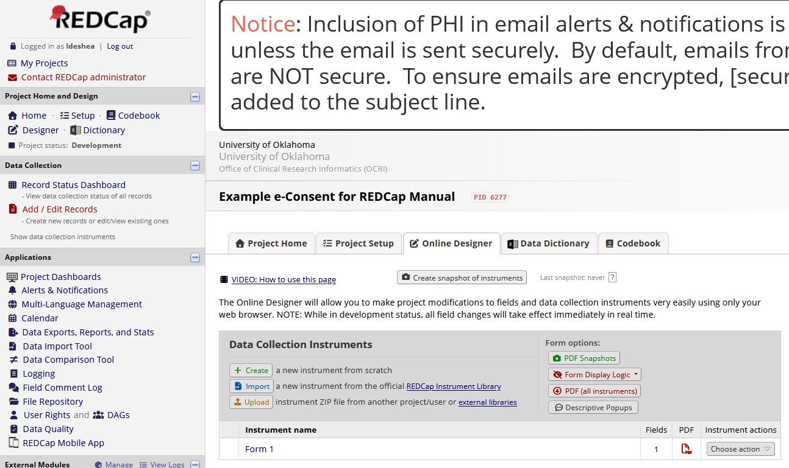{width="80%"}

You will need to create two instruments: one for the consent form and one for the HIPAA form (if applicable).

- Change the name of Form 1 to Consent by clicking on the gray button labeled *Choose actions" to the right of Form 1.
- Select *Rename.*
- Modify the information in the window that pops up, as shown below.
- The first box is the name that will appear in Designer, and the second box is how the form will be referenced inside the REDCap data collection.
- Once these changes are made, click *Apply.*
-
   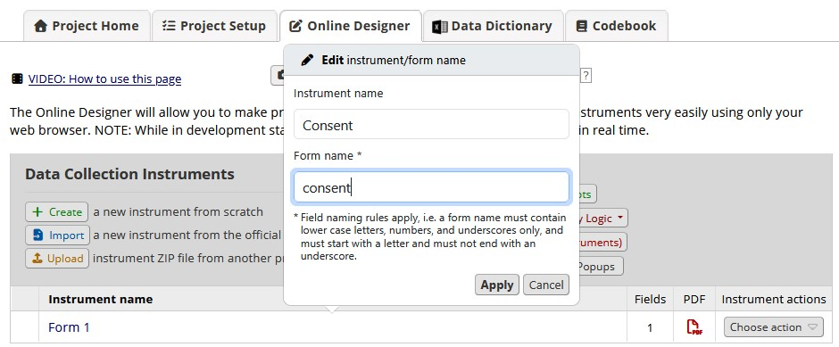{width="80%"}

Now create a new instrument called HIPAA by clicking on the button that says *Create.*

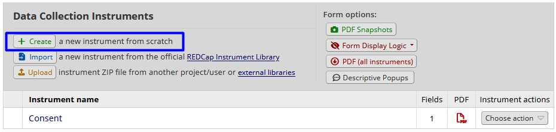{width="80%"}

A green button will appear, as shown below. Click that button and enter *HIPAA* as the form name (and *hipaa* in the second box).

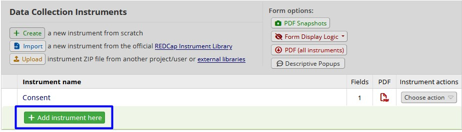{width="80%"}

These two REDCap instruments will contain pdfs for the consent and HIPAA forms.
Next we will create the fields needed for these forms to allow completion within REDCap.

## Modifying the REDCap Instruments for Consent and HIPAA

We will be collecting signatures electronically for the consent form, which participants typically have signed on paper.
We need to create fields in REDCap that the participants would have filled out on paper.
The consent and HIPAA forms shown below are templates from the OUHC IRB.
Please ignore the old dates.

### Consent Form

Read the consent form and identify every field that a participant or researcher would have to complete.
Often the only fields that will need to be completed appear at the end of the document, although occasionally researchers will list medical tests in the middle of the document that require the participant's initials.

Let's say participants in our example need to fill out only the fields shown below.

   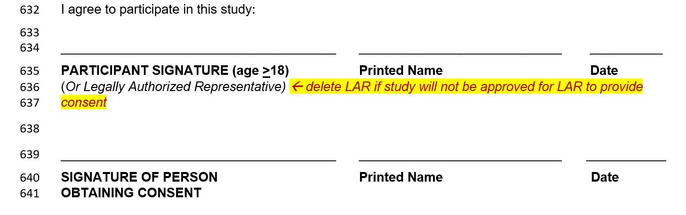{width="80%"}

In REDCap, click on the *Consent* form in Online Designer to get to the screen where we will create variables to replicate the fields shown above.
We will have the following fields and variable types:

- A signature field for the participant's signature
- Separate text variables for the participant's first and last names, even if they do not appear as separate fields on the pdf; separate fields are required in the e-Consent Framework in REDCap
- A date variable for the date of signature
- A signature field for the person obtaining consent
- A text variable for the typed name of the person obtaining consent
- A date variable for the consent obtainer's date of signature.

Other consent forms may have fields for a witness to sign and for a child to sign indicating his or her assent.
(Children cannot sign a legal form granting consent; the parent or guardian must grant consent.
But obtaining assent from a child old enough to understand that s/he will be participating in a study is the ethical choice.)
You will create those fields as well.

Create the needed consent fields listed above.
Make sure the participant's signature is a **required** field by clicking the button shown below.

   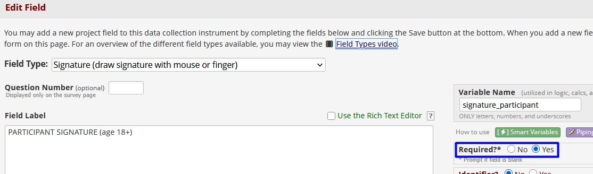{width="80%"}

   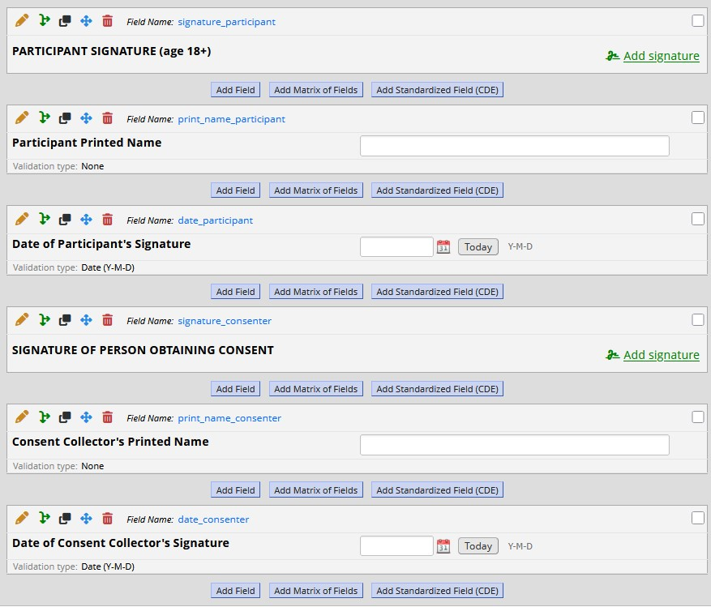{width="80%"}

The project now has the parts of the consent form that need to be filled out.
But our REDCap project needs to provide the potential participant with the pdf of the consent form.
Create a new *Descriptive Text* variable at the top of the Consent instrument (after Record ID) by clicking the *Add Field* button, shown below.

   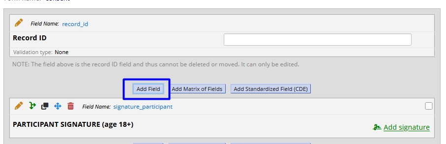{width="80%"}

You won't put anything in the box called *Field Label.*
In fact, the only specifications for you to make in this field is to name the variable *consent* and make it a Descriptive Text field.
This field is a placeholder for the pdf of the consent form, which we will upload in the e-Consent Framework.

### HIPAA Form

Now follow the same process for the HIPAA form:

- Identify all elements that would be filled out on a printed HIPAA form
- Go into the HIPAA instrument on REDCap and create those fields
- Be sure to include the Descriptive Field called *hipaa* and upload the HIPAA pdf, setting it to appear inline

## Enabling Surveys

Before the consent form can be designated as such in the e-Consent Framework (that is, the REDCap module for electronic consent), we must specify that the forms are on a survey.

### Tell REDCap to Allow Surveys

On the Project Setup tab, click the *Enable* button next to the words "Use surveys in this project."

   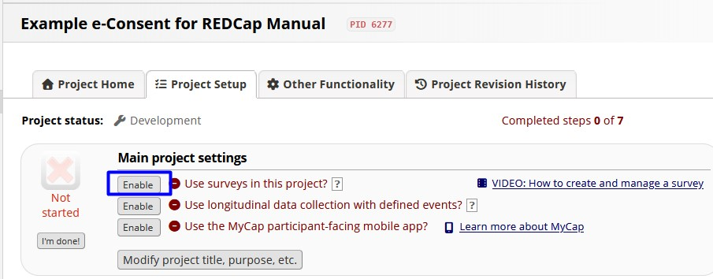{width="80%"}

Return to Online Designer and click on the *Enable* button on the line showing the Consent instrument.

   {width="80%"}

You will be taken to a new screen, shown below, where you will specify how the survey will look and perform.
We will illustrate only the most important details.

   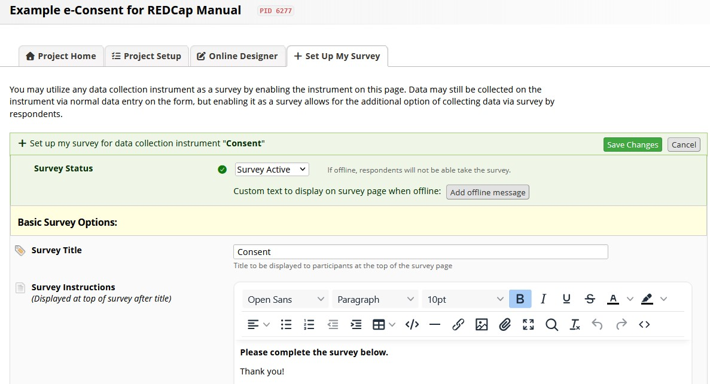{width="80%"}

Scroll down to Survey Theme. The default theme is black, white, and light blue.
A common choice for a theme at OU is Red Brick because the colors are similar to those of the university.
The investigators running your study may have a preference, and they might even have a logo to include on the survey, which could be uploaded on this screen.

   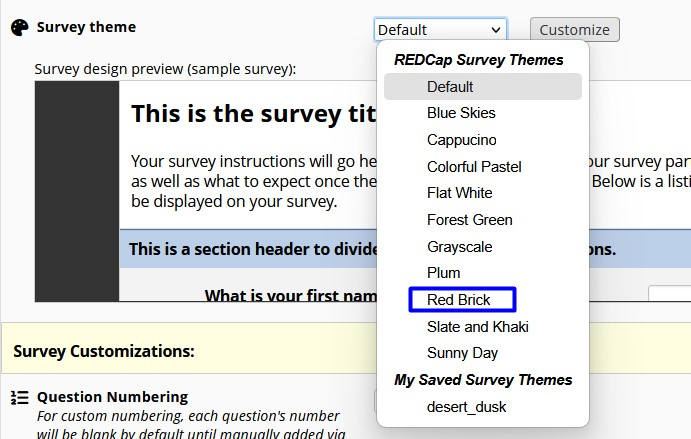{width="80%"}

Scroll down to *Survey Termination Options.*
Place a checkmark in the box *Auto-continue to the next survey* because we want the person to sign the Consent form, then the HIPAA form.

   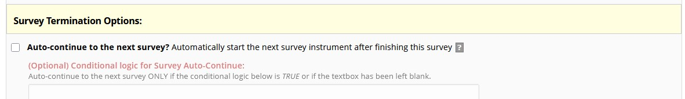{width="80%"}

- Click the *Save Changes* button at the bottom of the page.
- You will be taken back to Online Designer.
- Now click the *Enable* button on the HIPAA line.
- Select the *Survey Theme* to match the one you used on the consent form, then click *Save Changes.*

## Enable e-Consent Framework

Finally we can enable the e-Consent Framework, the REDCap module that was designed to handle electronic consenting processes.
This step must occur after the surveys (Consent and HIPAA) are created.
In Online Designer we click the *Enable* button under Survey Options, shown above the list of instruments.

   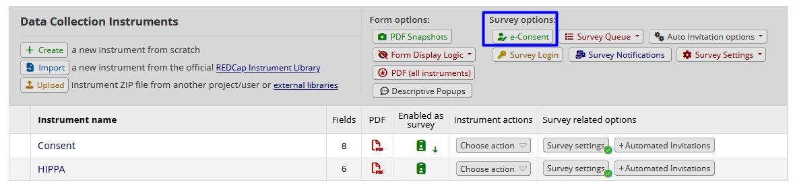{width="80%"}

You will be taken to a page called *Settings for e-Consent & PDF Snapshots.*

   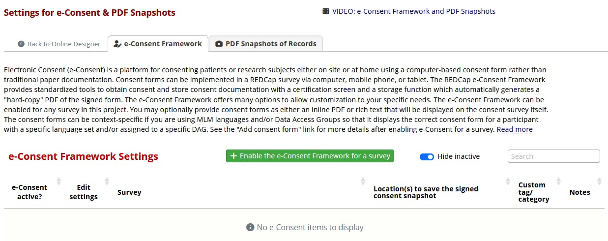{width="80%"}

Click the big green button that says *Enable the e-Consent Framework for a survey.*
You will get a window that says *Enable e-Consent for a Survey.*
You will select Consent from the drop-down menu.

   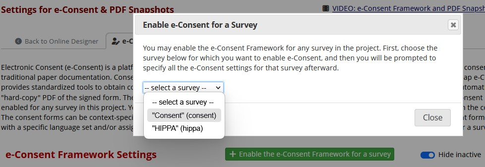{width="80%"}

Another window will open, called *Enable e-Consent.*

- Under *Primary settings,* the first two fields ask you to specify the variables for the first and last names of the participant.
- Scroll down to *Additional settings* and use the drop-down menu for *Signature field #1* to select the participant's signature, as shown below.

   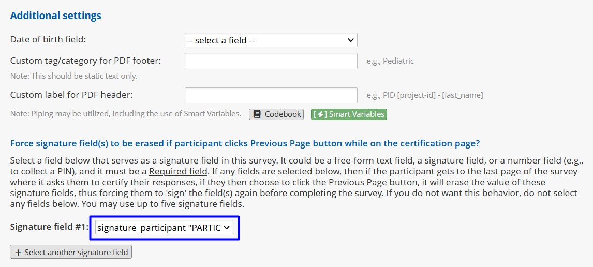{width="80%"}

- Scroll down to *Location(s) to save the signed consent snapshot.*
- A copy of the signed form should be saved in the File Repository because the IRB sometimes audits these e-consent REDCaps to make sure the study's protocol is being followed and patients' rights have been respected.

   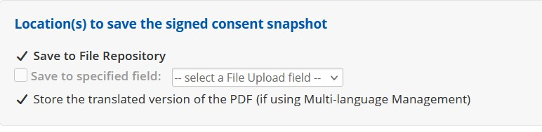{width="80%"}

Save those settings to close the window.
You will return to the page that says *e-Consent Framework Settings.*
This is where you will upload the pdf of the consent form.
Click on the link that says *Add consent form.*

   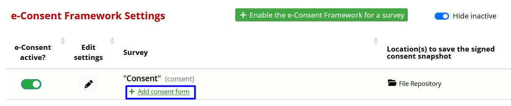{width="80%"}

- Number the consent form (e.g., 1.0) next to *Consent form version.*
- Use the dropdown menu next to *Placement of consent form* to choose the placeholder variable you called *consent.*
- Click on the tab for *Consent Form (Inline PDF).
- Click *Browse* and find the pdf on your computer.
- Click *Add new consent form* to save your work

   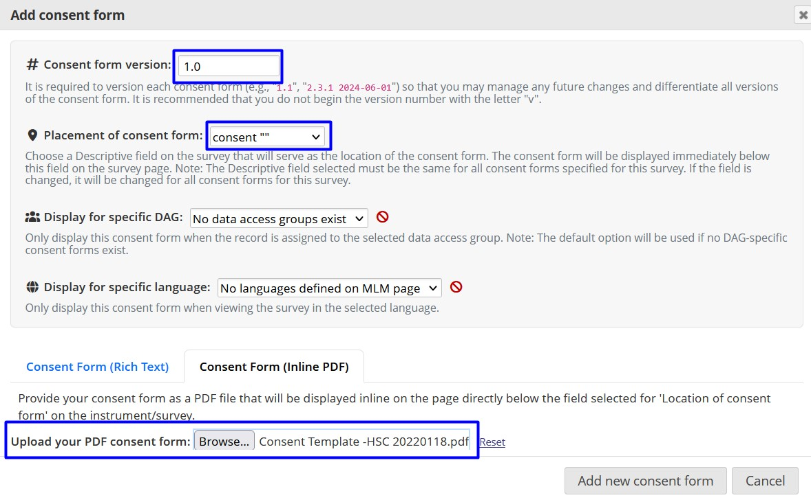{width="80%"}

Next we need to get a snapshot pdf of the signed HIPAA form.

- Click on the tab for *PDF Snapshots of Records.*
- Click on the button that says *Add new trigger.*

   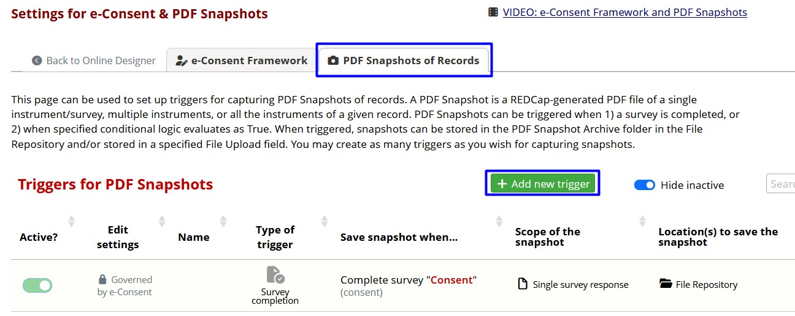{width="80%"}

- Name the trigger and select the HIPAA survey
- Under *STEP 2: Scope of the snapshot,* click the pencil in the box
- Deselect the consent form, leaving only the HIPAA form as a trigger; the consent form is being saved separately
- Save these settings

   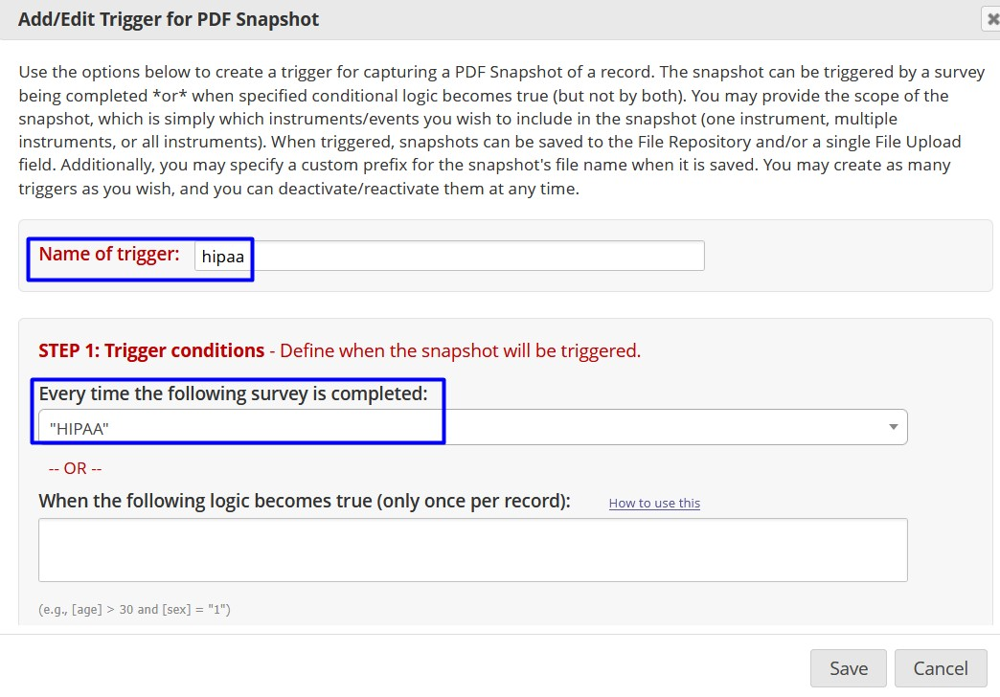{width="80%"}

   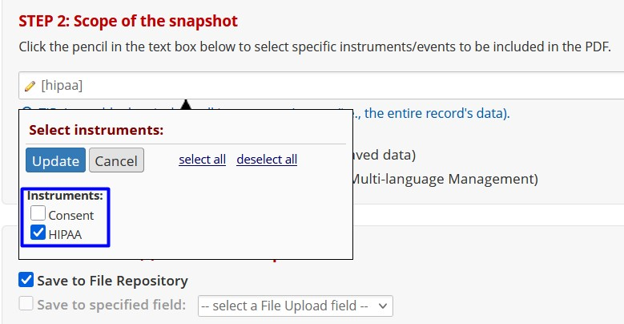{width="80%"}

## Test the e-Consent

Before putting any REDCap project into production, it is important to test it and make sure everything is working right and looks correct.
It is a good idea to enlist the researchers and those who will collect e-consent in the testing process.

In the REDCap project, click on *Survey Distribution Tools* in the left column

   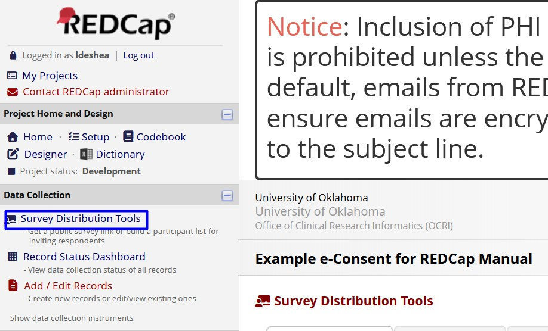{width="80%"}

This page will provide you with a public survey link that you can email to the researchers and consent collectors.
To test the project yourself, click *Open public survey.*

   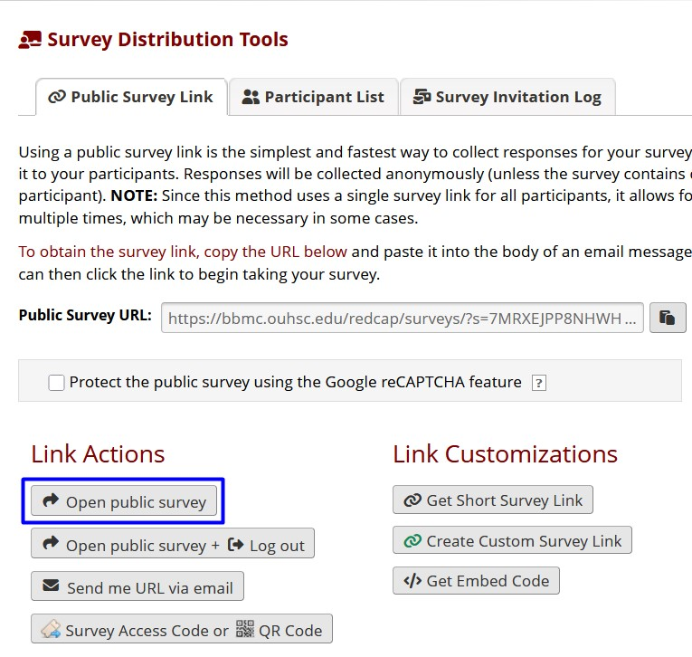{width="80%"}

You will be taken to the e-consent as it will appear to participants.

- Scroll through pages, fill out the pertinent fields with names like *Test Subject,* and sign it.
- After you submit the HIPAA form, you will get an "end of survey" message.
- Go back into the REDCap project.
- On the left side you will see a link for *File Repository,* which you will click.

   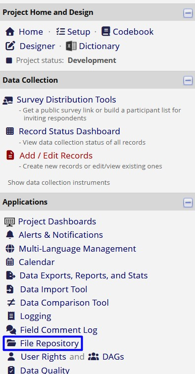{width="80%"}

- Click on the folder labeled *PDF Snapshot Archive.*
- You will see a list of pdfs that were automatically created for the test records.
- Click on any of those pdfs and see how REDCap saved the original pdf, plus the fields you created in REDCap, and the data and signature added by the participant or test subject.

   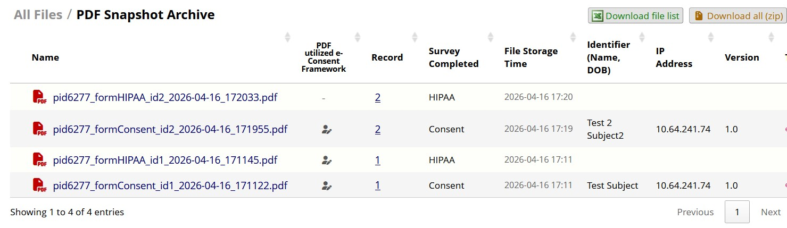{width="80%"}

## Updating Consent Forms

Studies with IRB oversight must check in annually and update the IRB about the study's status.
Among other tasks the researchers must obtain re-approval of their consent form.
When you create an e-consent project, it is a good idea to put a note on your Outlook calendar reminding you to check with the researchers before their consent form expires.
Then you will be ready to replace the consent and HIPAA forms with the latest versions, with the new expiration date given.

When it is time to replace the consent form with a new one:

1. Notify the people who will be collecting the study's informed consent that you will be working on the e-consent in REDCap and that they should pause using the e-consent until you inform them the new forms have been uploaded
2. In Online Designer, there will be a yellow box at the top saying the project is in production status and asking if you want to enter draft mode to make changes; click the *Enter Draft Mode* button.
3. Where the Data Collection Instruments are listed in Designer, click on the e-Consent button under Survey Options.
4. Click *Add Consent Form*
5. Specify the version number and upload the consent form
6. Save the new version
7. Ask for the project to be moved back into Production Mode
8. After being notified that the project is in production, go to the survey and create a test record by completing the forms, using a name like *Testing REDCap*
9. If everything is working correctly, notify those collecting informed consent that the e-consent REDCap is back in production with the new forms, and they may see a test record in REDCap
10. Congratulate yourself, because it is no small accomplishment to complete an e-consent REDCap project!

::: {.callout-note appearance="simple"}

## Additional Chapter Details

This chapter was last edited in April 2026.
If you have suggested modifications or additions, please see [How to Contribute](../index.qmd#sec-welcome-contribute) on the book's welcome page.
:::
