# Multi-Language Management {#sec-designadv-multilanguage}

**Chapter Leads**: Lise DeShea, Thomas Wilson

## What is the Purpose of Multi-Language Management? {#sec-designadv-multilanguage-purpose}

Researchers often need to recruit study participants from a variety of backgrounds.
A study with greater variability in participants may be more generalizable to a larger population.
Language can be a barrier to some participants joining a study.
When researchers can offer a survey in the participants' languages, there is a better chance of expanding the patient pool, which might be crucial if the researchers are studying a rare condition.

The first step toward enrolling patients in most studies is obtaining informed consent.
Electronic consent is possible in REDCap, and we have provided a chapter on that topic. @sec-designadv-econsent

Creating an e-consent process that also allows multiple languages means the e-consent chapter must go hand-in-hand with this one.
This chapter will assume you are at a spot in creating an e-consent where you need to enable Multi-Language Management (MLM) and will lead you through the process.
MLM also can be used with surveys and other uses.
The information presented here can be generalized beyond the e-consent process.

## When to Enable MLM in an e-Consent {#sec-designadv-multilanguage-timing}

We will start at the point in an e-consent project where you already have created the instruments for Consent and HIPAA; uploaded pdf files of those forms; created fields for every spot where the patients will need to enter information or sign their names; and designated the forms as surveys.

The e-Consent Framework is the REDCap module that was designed to handle electronic consenting processes.
**Before** you enable e-Consent Framework, you must enable Multi-Language Management (MLM).
If you do these two steps in the wrong order, you will have to re-create a lot of the work you already completed.

## Enabling MLM {#sec-designadv-multilanguage-enable}

The left-hand column in your project has the REDCap logo. Under the second **Applications** you will see Multi-Language Management (MLM).
Click that link.

   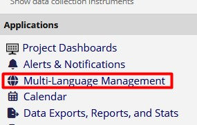{width="80%"}

Follow the instructions in the Languages tab of the page, as shown below.

   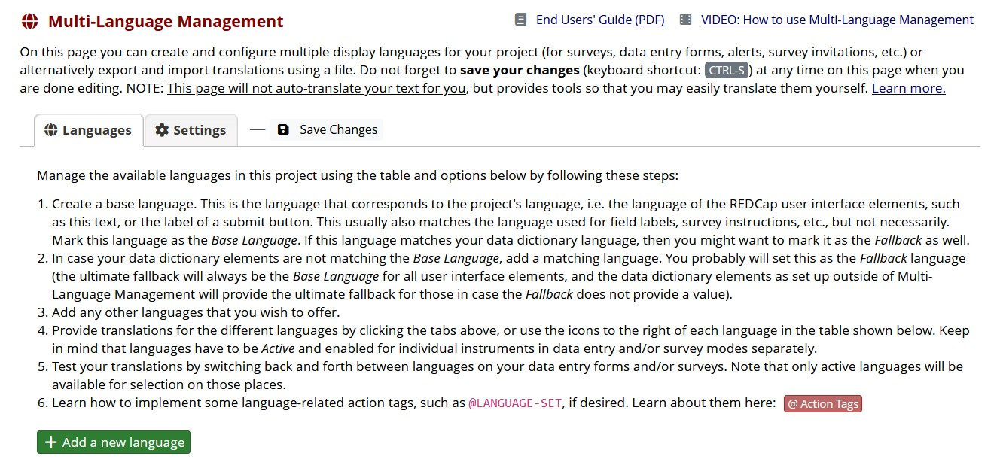{width="80%"}

You see the above instructions because no languages have been specified in the MLM.
Read those instructions carefully.
MLM is picky and has a lot of details.
We will be following those steps: specifying the languages being used in the e-consent (or survey), providing translations of REDCap features, and testing the project.
We will start by specifying a base language, which usually is English.
Click the green button that says, "+ Add a new language."
You will see the window shown below.

   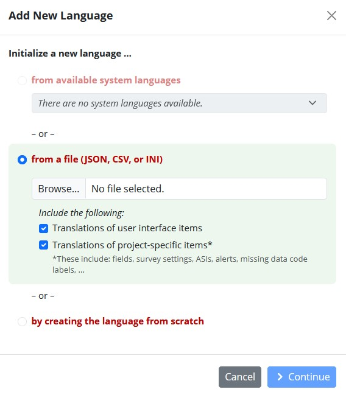{width="80%"}

There is a white button that is barely visible next to the red words "by creating the language from scratch." Click there, then Continue.
We are starting with English as the base language.
Type the Language ID for English, which is en.
"Language Display Name" is what will appear to people who will be asked to sign the e-consent.
Type English there.
So the window now looks like this.

   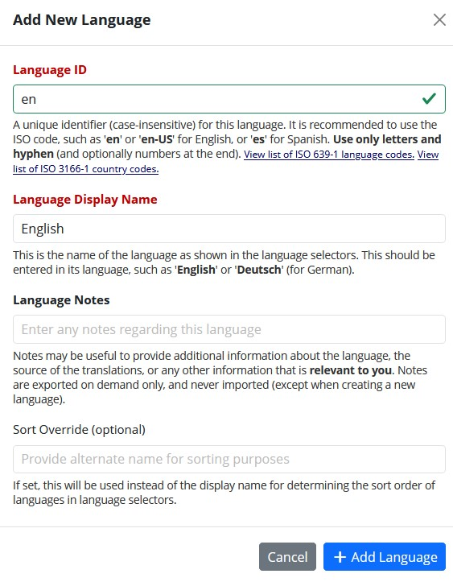{width="80%"}

Click the blue "+ Add Language" button.
The window will close, and now the page shows English as the base language.
Let's add Spanish as the next language.
Click the green "+ Add a new language" button again.
Again, click the nearly invisible button next to "by creating the language from scratch," then Continue.
We will use es as the Language ID.
For Language Display Name, we need it in Spanish for those who will select that language: Español.
To get the tilde over the n in this word, you can google Espanol and copy it from a webpage and paste it in this box.
Then click the blue "+ Add Language" button.

   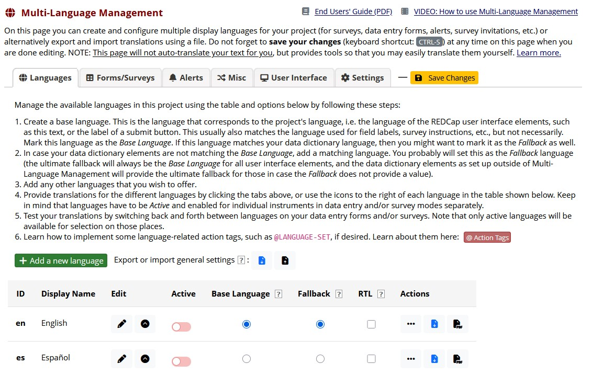{width="80%"}

You may notice the yellow-orange button that says Save Changes.
Unlike many functions in REDCap, this module has the save function at the top of the page, not the bottom.
This same button will be used for changing any of the tabs to its left.
If it is yellow-orange, then changes have not been saved.
Click it now to save the changes made so far.
You should see the button change to gray font.

## Touring the MLM Tabs {#sec-designadv-multilanguage-tabs}

MLM has tabs embedded in tabs -- and tabs embedded within those tabs!
It is easy to get lost and sometimes hard to find certain functions.
Let's click through these tabs and familiarize ourselves with them.

The **Forms/Surveys** tab has two tabs embedded within it: English and Español.
First you see the base language with a blue tab that says "*English."
When you click on the word Español, you are switched to that tab, which now is the blue tab.

We will not cover the next two tabs, **Alerts** and **Misc** because they usually are not used in e-consent projects.

Click on the **User Interface** tab.
If you left the Forms/Surveys tab on its embedded Español tab, then that's the tab in blue here.
The purpose of the User Interface tab is to translate some text that the user of the e-consent will see from the base language (English) to our second language (Spanish).
Notice that this page has a third layer of embedded tabs, shown in the blue box below.

   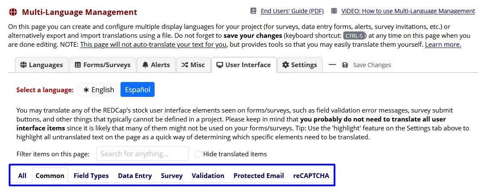{width="80%"}

Let's click through those tabs.

* We could look at everything option under the All tab, but that can be overwhelming.
* By default the Common tab is selected.
You can scroll down to see the kinds of notifications to the user that you could translate.
For an e-consent project, you often have only a few of these notifications that need to be translated.
* Now click on the Field Types tab.
If your project has Yes/No fields, then you would need to translate "Yes/No" on this tab.
If your project has a Date field that uses a "Today" button, you will need to translate that word.
There are far more options on this tab than you are likely to need to translate.
* Let's click next on the Settings tab.
You might wish to click the slider next to "Discourage browser-based translation of survey pages," because you are providing the translations.

At this point we have put English as the base language and Spanish as the second language.
But we have not activated them.
On the Languages tab, toggle the sliders to Active.

   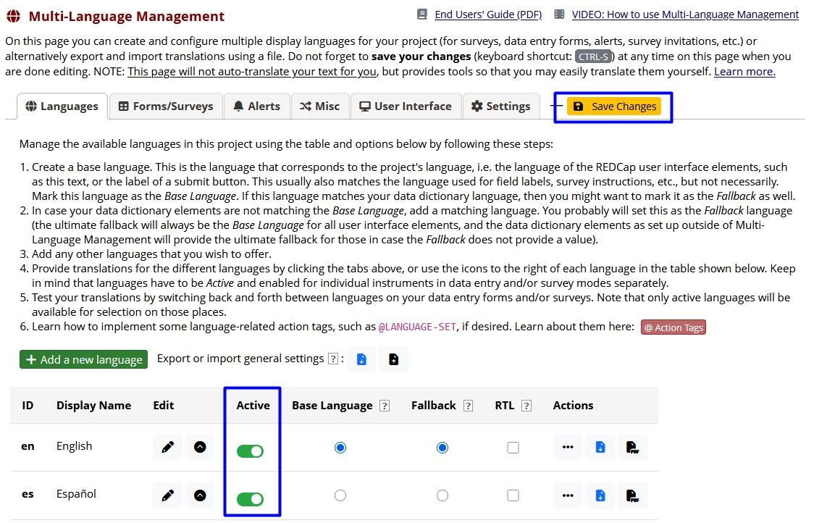{width="80%"}

Notice the Save Changes button is yellow-orange again. Click it to save your current settings.

## Creating Translations {#sec-designadv-multilanguage-translations}

Go to the Forms/Surveys tab and select the Español tab.
Toggle the sliders in the column under Data Entry and Survey.
These sliders will enable the e-consent user to view the translated version of the instruments.
Be sure to click the yellow-orange Save Changes button.
It doesn't hurt to click that button after every change you make!
At any point when you make a change and the Save Changes button stays gray, click outside of the field you just changed to make it turn yellow-orange.

   {width="80%"}

Notice in the above screenshot that the word Translate appears next to each instrument in the Fields and Survey Settings columns.
There are more functions to access by clicking each place that it says Translate.
Let's start with Translate under the Fields column on the Consent row.
This page shows the variable names inside REDCap.
The Spanish-speaking participant using the e-consent survey will never see those variable names.
Unless you have staff needing translation inside the REDCap project, we don't have to make any changes here.
This Fields page will show a link to the Survey Settings for this instrument.
Click that link.

   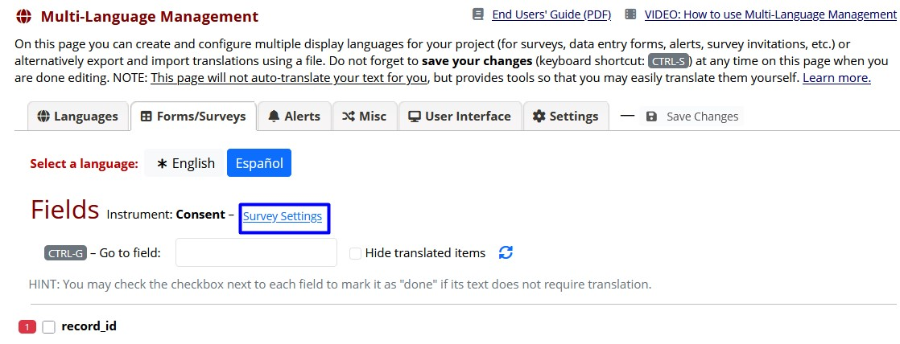{width="80%"}

This is where you can translate the survey title and prompts that users will see as they go through the e-consent process.
For example, the e-consent used as an example in this chapter is set up so that upon completing the e-consent, the user sees a message, "Thank you!" Below is shown the translation of that message.

   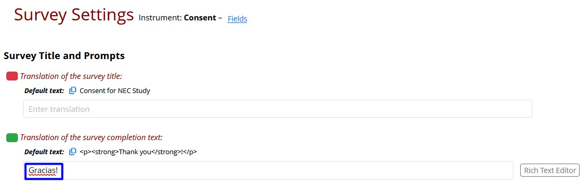{width="80%"}

Notice on the top row of text in the above screenshot, there is a link to Fields.
Click that link.
Now you will see the Field Labels that correspond to the variables in your e-consent.
You will need to translate those Field Labels.
For example, if you have "PARTICIPANT NAME (printed)" as the label for a field called participant_name_printed, you would need to enter the translation "NOMBRE DEL PARTICIPANTE (en letra imprenta)."
As always, click the yellow-orange Save Changes button.

To look at translations needed on the HIPAA form, click the Languages tab and back to the Forms/Surveys tab.

* Now you will see the two rows marked Consent and HIPAA again.
* Click Translate in the Fields column to make any changes needed there.
* Then click Translate in the Survey Settings column to make any changes needed on the HIPAA instrument.
* If the Save Changes button has not turned yellow-orange, then click outside of the field your cursor was on, and the color will change.

Now let's do translations in the User Interface tab.
Again, staying on Español next to **Select a language**, click the Common tab.
Make any translations needed, then click Save Changes.

The next tab inside User Interface is Field Types.
Look for any fields your e-consent or survey will need translated, enter the translations, and click Save Changes.

We will skip the Data Entry tab inside User Interface.
In the Survey tab of User Interface, you may find several items that need to be translated. Here are some messages listed under the eConsent section of the Survey tab:

   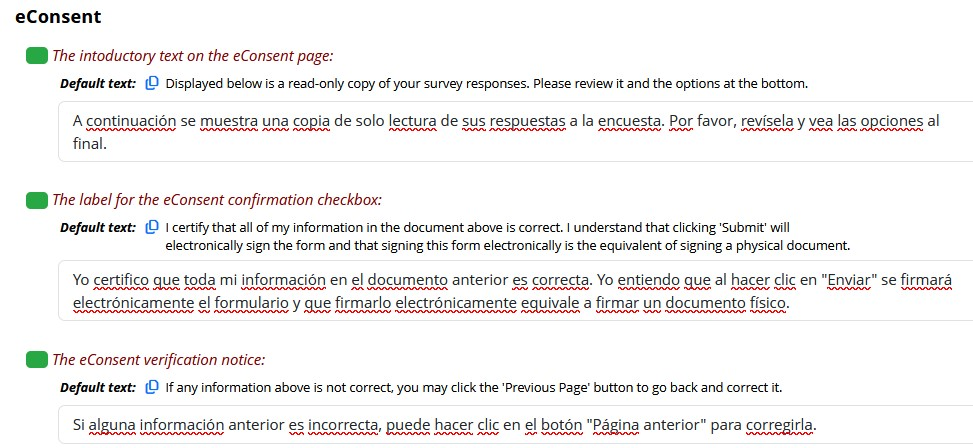{width="80%"}

 Look for any fields that you need to translate. Here are a couple of common ones.

   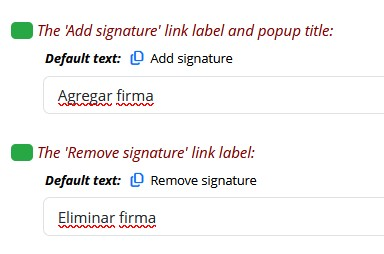{width="80%"}

## Enable e-Consent Framework {#sec-designadv-mlmbacktoeconsent}

Finally we can enable the e-Consent Framework, the REDCap module that was designed to handle electronic consenting processes.
Go back to that chapter to complete the e-consent project. @sec-designadv-econsent

::: {.callout-note appearance="simple"}

## Common fields requiring translation into Spanish {#sec-designadv-mlmspanishterms}

Spanish is the most common language used in the OU REDCap's MLM.
Investigators will have to arrange for their own consent and HIPAA forms to be translated.
Here are some commonly used User Interface words/phrases in English that we have translated into Spanish:

* Must provide value: debe aportar valor
* PARTICIPANT NAME (printed): NOMBRE DEL PARTICIPANTE (en letra imprenta)
* PARENT SIGNATURE: FIRMA DEL PADRE/MADRE
* Date: Fecha
* SIGNATURE OF PERSON OBTAINING CONSENT: FIRMA DE LA PERSONA OBTENCION DEL CONSENTIMIENTO
* Printed name: Nombre impreso
* Initials: Iniciales
* Today: Hoy
* Signature of Legal Representative: Firma del Representante legal**
* Next page: Página siguiente
* Previous page: Página anterior
* Submit: Enviar
* The M-D-Y date format indicator: Mes-Día-Año
* Add signature: Agregar firma
* Remove signature: Eliminar firma
* Use a mouse, finger, or stylus to draw your signature in the area below: Utilice el ratón, el dedo o un lápiz óptico para dibujar su firma en el área de abajo
* Type signature: Firma de tipo
* Type your signature: Escribe tu firma
* Draw signature: Dibujar firma
* I certify that all of my information in the document above is correct. I understand that clicking 'Submit' will electronically sign the form and that signing this form electronically is the equivalent of signing a physical document: Yo certifico que toda mi información en el documento anterior es correcta. Yo entiendo que al hacer clic en "Enviar" se firmará electrónicamente el formulario y que firmarlo electrónicamente equivale a firmar un documento físico.
* If any information above is not correct, you may click the 'Previous Page' button to go back and correct it: Si alguna información anterior es incorrecta, puede hacer clic en el botón "Página anterior" para corregirla.

## Additional Chapter Details {#sec-designadv-multilanguage-chapterdetails}

This chapter was last edited in September 2026.
If you have suggested modifications or additions, please see [How to Contribute](../index.qmd#sec-welcome-contribute) on the book's welcome page.
:::
