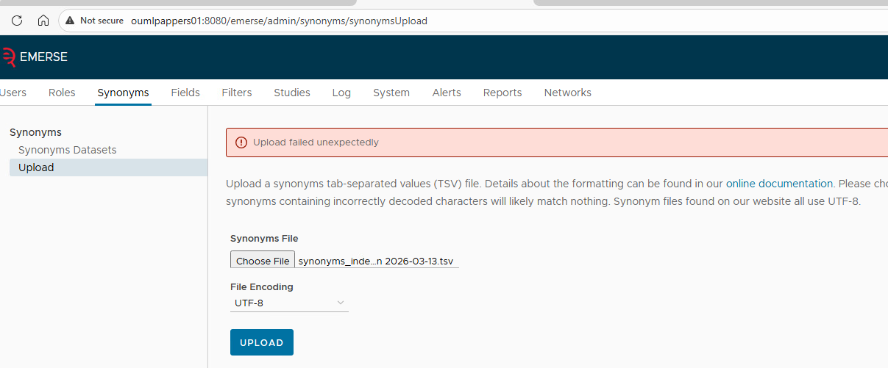
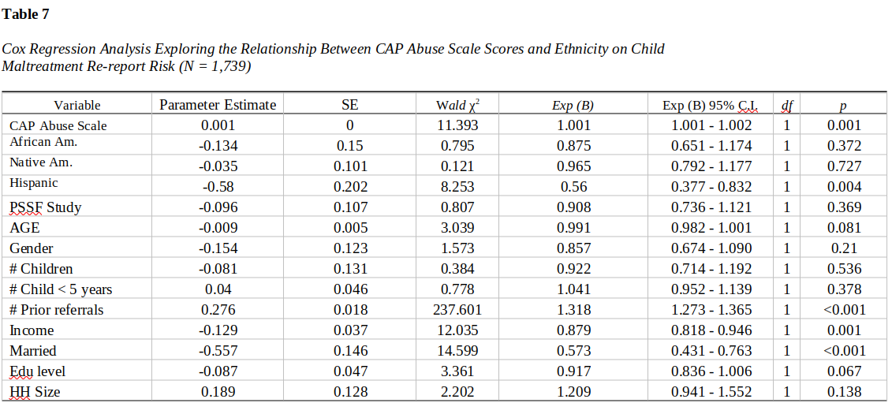

# Static Randomization of Patients {#sec-designadv-randomstatic}

**Chapter Leads**: Steven Fowler

::: {.callout-warning appearance="simple"}

## Chapter Draft

This chapter is being written currently,
as is available during development in case the preliminary version is helpful to someone.

If you have suggested modifications or additions, please see [How to Contribute](../index.qmd#sec-welcome-contribute) on the book's welcome page.
:::

## What is the Purpose of Randomization? {#sec-designadv-randomstatic-purpose}

To learn how to request a new project, see [Best Way to Learn](variable.md#sec-designbas-variable-howtolearn).

## Preparing to Build the e-Consent

{width="80%"}

{width="80%"}

::: {.callout-note appearance="simple"}

## Additional Chapter Details

This chapter was last edited in April 2026.
If you have suggested modifications or additions, please see [How to Contribute](../index.qmd#sec-welcome-contribute) on the book's welcome page.
:::
