# Variable Decisions {#sec-designbas-variable}

**Chapter Leads**: Lise DeShea & Thomas Wilson

## Variable decisions {#sec-designbas-variable-decisions}

When you are creating and managing a database, many decisions must be made about variables.
A variable is a quantity or property that can take on different values.
"Name" is a variable.
"Age" is a variable.
These are two kinds of variables.
Data are stored in variables.
REDCap accepts many kinds of data, including file uploads and signatures.
But you have to tell REDCap what to expect when you create variables.
Further, you need to think about what to name a variable.
If you named everything "item_1," "item_2," "item_3," etc., whoever analyzes the data
will have a hard time understanding what the variables mean.
This chapter will lead you through many decisions about variables.

## Variable names {#sec-designbas-variable-variablenames}

The most basic detail to decide about a variable is what to call it: the variable name.
That decision often is tied up in what kind of variable it is.
We will show you how to create a variable inside an existing form in a practice project.
We also will explain the difference between a variable *name* and its *label*.

We need to go into the Online Designer.
When you log into REDCap and click on a project name, you will have two ways to get
into Designer.
One is in the top left corner of your screen, with a link called *Designer*.

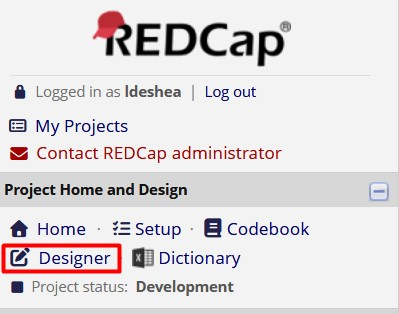{width=80%}

The other way is on the same screen in the middle of the page with a box labeled *Online Designer*.

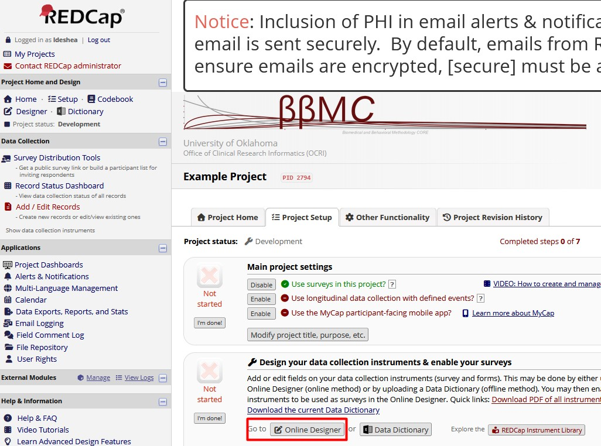{width=80%}

Either way, you end up on the same page, which lists the forms in the project.

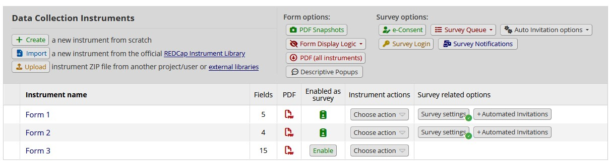{width=80%}

Clicking on any form name will open it.
Form 1 in this project already has variables in it.
The Record ID is automatically created by REDCap and cannot be deleted.
It is a unique identifier for each record entered in the project.
It can be renamed, but we will leave ours alone.

## Variable names vs. labels {#sec-designbas-variable-namesvslabels}

To edit a variable, click on the little pencil icon.

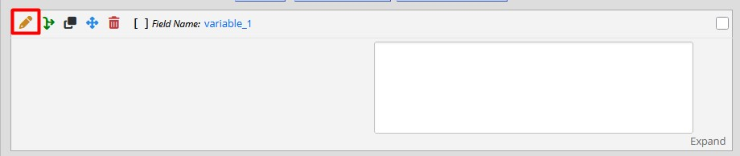{width=80%}

We get a new window labeled *Edit Field*.
We can learn several things about this variable from this window.
First, it is a *Notes Box* (Paragraph Text) field.
That means it could be used to enter a description of a clinic visit, for example.

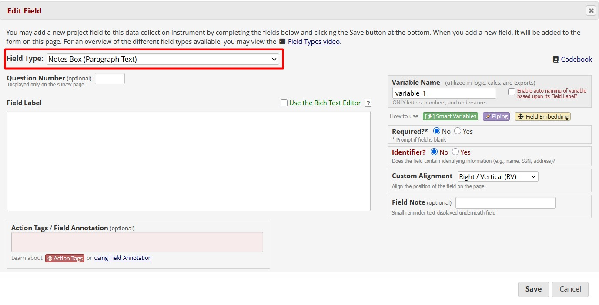{width=80%}

You see that the large box under *Field Label* is blank.
No label has been created for this variable.
Further, on the right side of the window is the *Variable Name*.
The Field Label is what shows up to the person filling out the form.
The Variable Name is used to store the data inside REDCap.
An analyst will use the variable name.

*variable_1* is a poor name for a variable because an analyst would not know
anything about the data simply by looking at that variable name.
Let's change it to *visit_note* and add a label to match, then click Save.

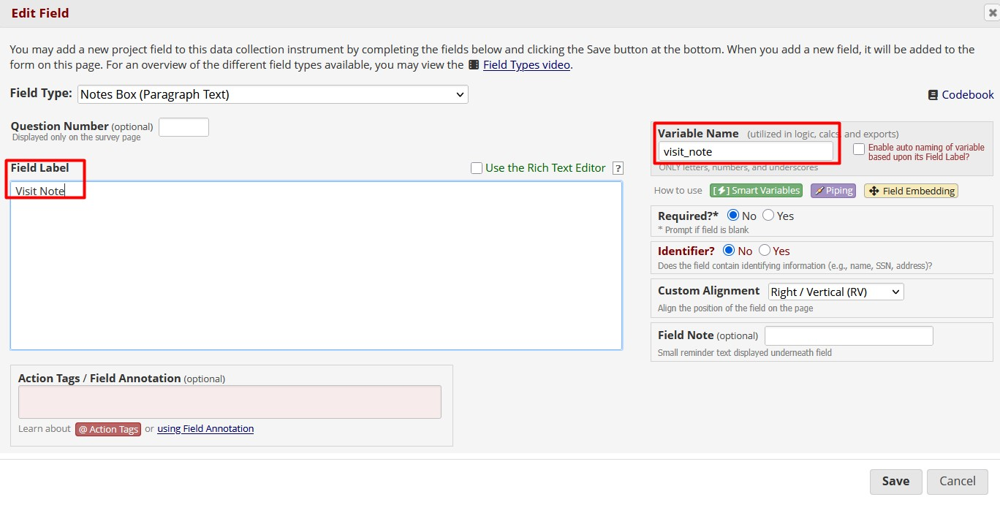{width=80%}

Let's look at *variable_2*.
This variable was created as a *Text Box (Short Text, Number, Date/Time, ...)*.
Let's change the variable name to capture a participant's first name

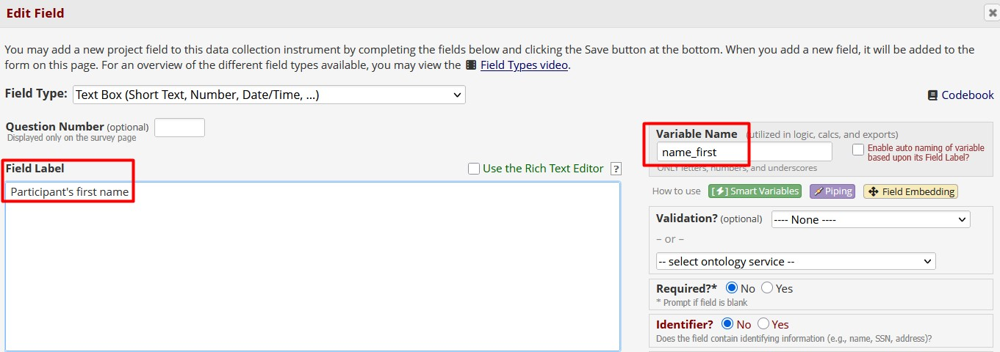{width=80%}

Note that we did not name the variable *first_name*.
We recommend starting the variable name with something general, then getting more
specific.
Then the analyst could see all the variables involving someone's name and distinguish among them.
When you are creating variables in REDCap, it's a good idea for you to be
quite familiar with the study, survey, or investigation *before* you start
creating variable names.
If this study collected data for a parent and a child, then *name_first* would be a poor choice.
A better choice might be *name_parent_first.*

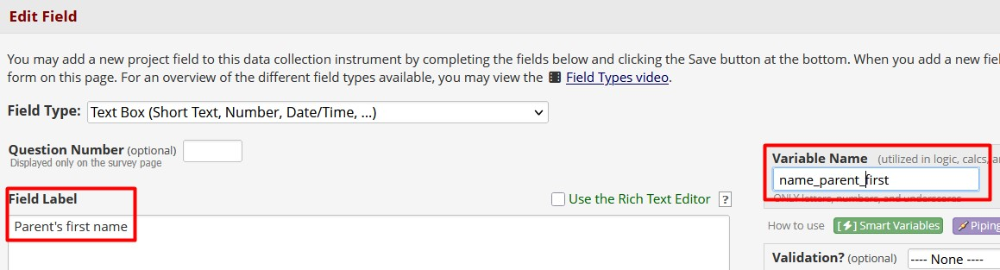{width=80%}

## Field Types {#sec-designbas-variable-fieldtypes}

As mentioned above, REDCap can capture many kinds of data.
Let's look at variable_3 and see what kinds of variables are available.
Next to the words *Field Type* is a drop-down menu of kinds of variables.

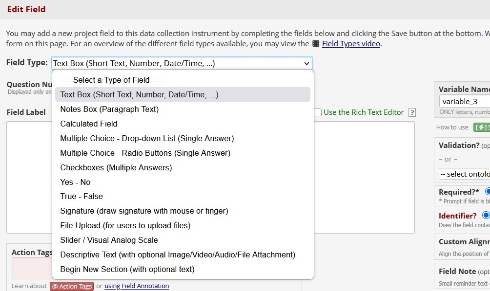{width=80%}

As the creator of a REDCap project, you are on the front line of ensuring data quality.
The specifications you enter for each variable can make a world of difference.
Your specifications can force a data entry person to enter a number with two decimal places
or ensure that an email address is in a valid format.
The specs also can set limits on numbers so a data entry person could not
accidentally enter a person's age as 150 years old, instead of 15.

### Text Box {#sec-designbas-variable-fieldtypes-textbox}

A *Text Box* field can handle many kinds of data.
How do we specify which kind of entries will be valid?
Suppose we want the data entry person to enter a child's age for a study
involving only children ages 2 through 8 years.
Further, two children from the same family could be involved in the study.
We will name the variable to specify we are talking about the first child,
and we will use a setting called *Validation*, which has a drop-down menu beside it.

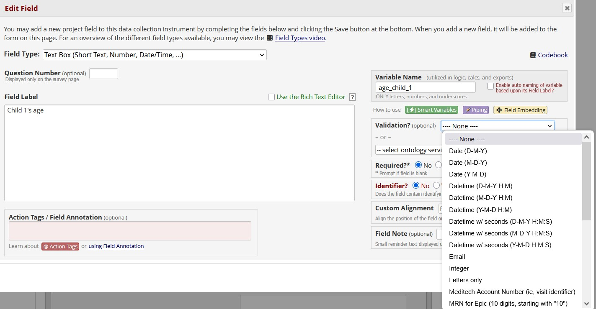{width=80%}

You can see a scroll bar on the right side of the drop-down menu.
There are many validation types from which to choose.
For child's age in years, we will choose Integer.
After we do that, we see options pop up for *Minimum* and *Maximum*.
We will enter the minimum and maximum ages possible for this study.

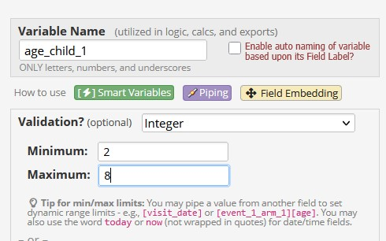{width=80%}

If someone entering data typed an age outside that range, an error message will appear,
saying the number is beyond the limits you set.

### Calculated Field {#sec-designbas-variable-fieldtypes-calculatedfield}

A Calculated Field can take a number from a previously entered variable and perform a calculation.
For example, the project already may have two variables capturing a newborn infant's number of weeks and number of days of gestation.
A data analyst might prefer to have one variable for analyzing gestational age, such as total days of gestation.
A formula can be written to take the previously entered weeks of gestation, multiply it by 7, then add the days (partial week) of gestation to get total days of gestation.
First, create a new variable and select Calculated Field as the field type.

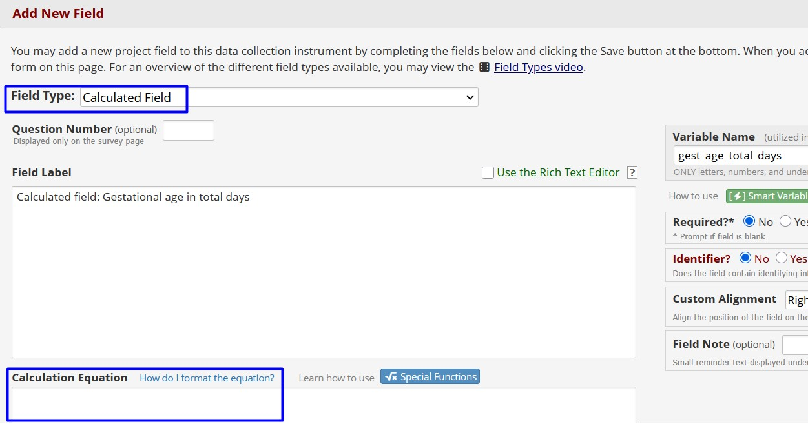{width=80%}

We have drawn a blue box around the field type and another one around the Calculation Equation box.
Notice there is a link beside the words "Calculation Equation" to instructions for formatting equations.
Click on the Calculation Equation box and enter your equation as shown in the example below.

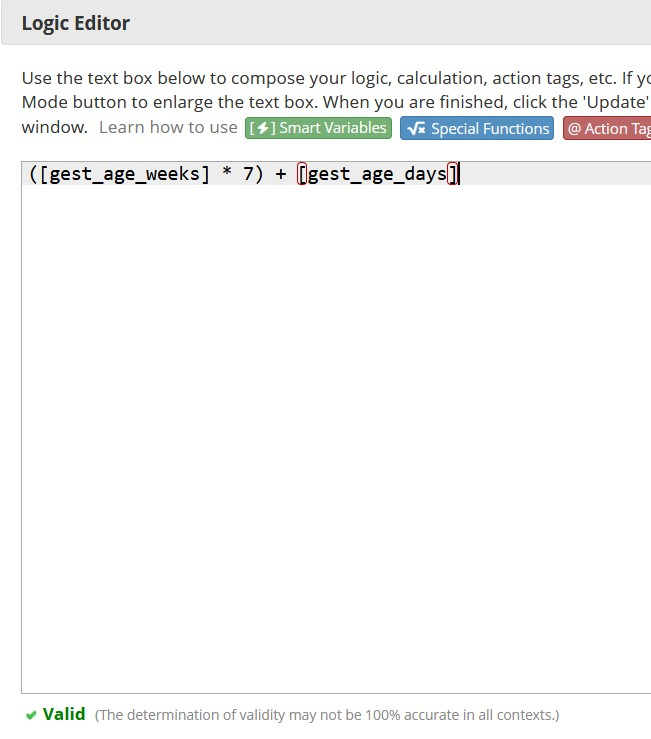{width=80%}

Notice the use of square brackets around both variable names used in the equation.
You can use parentheses liberally to make sure the order of mathematical operations is correct.
The spaces in this formula could be removed and make no difference to the Logic Editor.

### Multiple Choice - Drop-down list {#sec-designbas-variable-fieldtypes-multiplechoicedropdown}

Now we will explain the three kinds of multiple-choice fields available in REDCap.
A drop-down list of response options is helpful when you have a long list of options, such as state of residence, because it saves space. 
It also is helpful when the project has specified values for missing values, which can automatically appear as options in the list. 
The image below shows a variable with the Field Type: Multiple Choice - Drop-down List (Single Answer). 

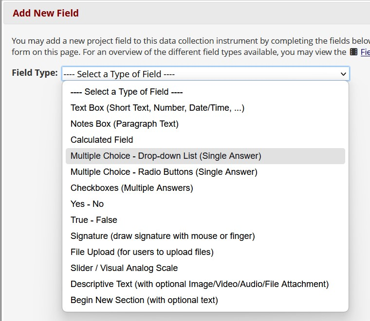{width=80%}

In the space at the bottom of the window, called "Choices (one choice per line)," you will see below that this field has the state abbreviation, followed by a comma, then the state name, with one state per line.

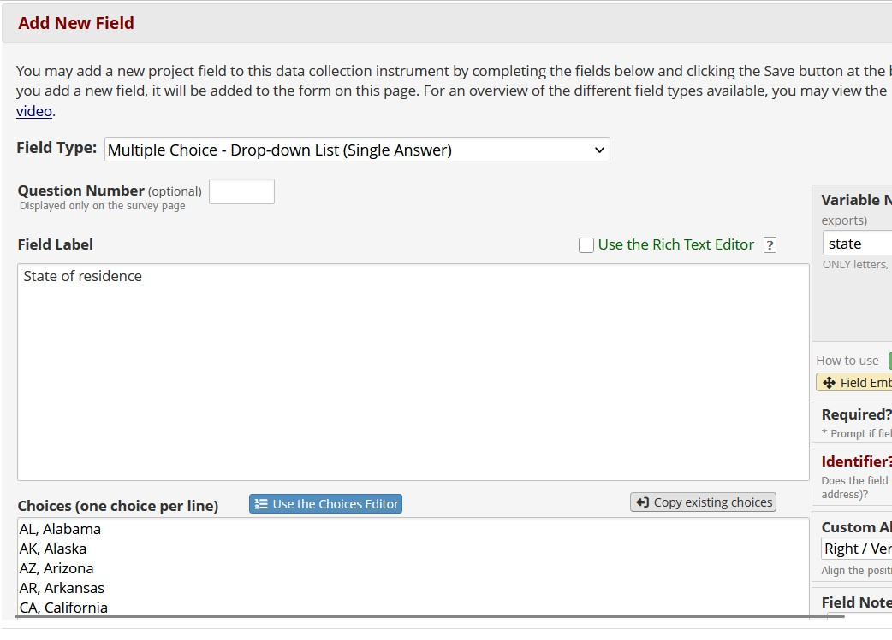{width=80%}

### Multiple Choice - Radio Buttons {#sec-designbas-variable-fieldtypes-multiplechoiceradio}

When you need fewer multiple-choice options, you can choose a Multiple Choice - Radio Buttons field. Everything else about  that field is the same as the drop-down list option.

### Multiple Choice - Checkboxes {#sec-designbas-variable-fieldtypes-multiplechoicecheckbox}

Checkboxes for a multiple choice item are different.
Checkboxes allow for multiple responses, such as you would need for an item saying, "Check all that apply."
Other than specifying "Checkboxes (Multiple Answers)" for the Field Type, this kind of multiple-choice item is just like the other multiple-choice items.

### Date variables {#sec-designbas-variable-datevariables}

Let's look at a date field.
We will change variable_4 in our example project to the date of birth for the first child in our study.

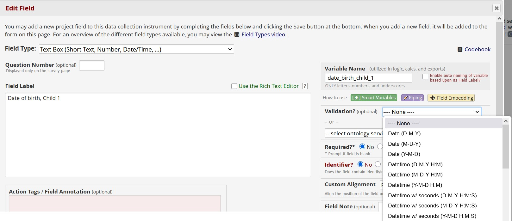{width=80%}

Date validation can be as general as a date or as specific as the date and time down to the second.
For a birth date, we usually only need the date.
We have 3 format options available to us: day-month-year,
month-day-year, or year-month-day.
Keeping with our recommendation of going from general to
specific, we will choose Y-M-D.
(This recommendation is in keeping with the International Organization for Standardization 8601, which you can find online.
This format eases sorting data by earliest to latest date.)

### True/False and Yes/No variables {#sec-designbas-variable-truefalseyesno}

These two kinds of variables are like multiple-choice items, except REDCap creates the response options for you.
Examples are shown below.

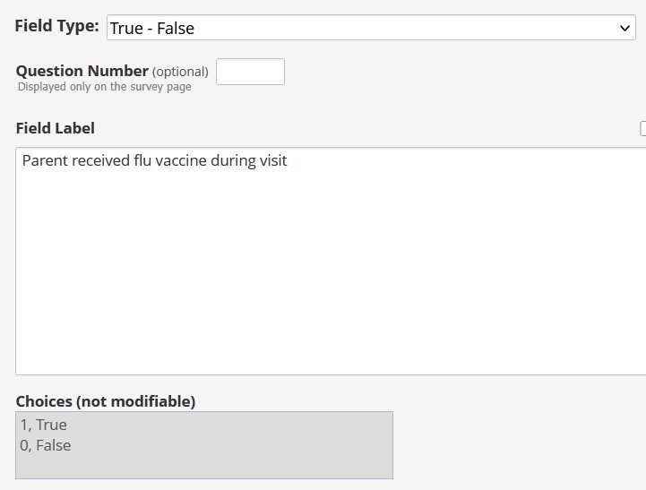{width=80%}

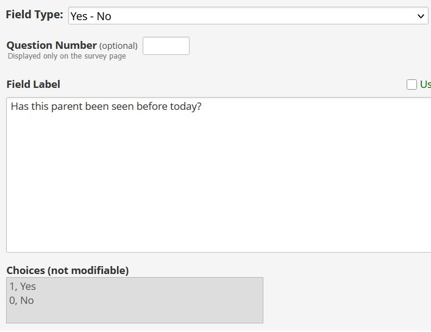{width=80%}

### Signature variable {#sec-designbas-variable-signature}

Sometimes an online survey will require a signature from the person completing it.
REDCap allows you to do that.
Here is a signature field as it appears in the Online Designer.
There is a link at the bottom right that will be active when a survey is created.

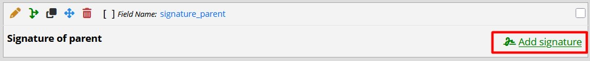{width=80%}

Here is what the field looks like when you click the pencil icon to edit it.
You will see there are few specifications.
You could specify whether it is a required field, whether it contains personal identifying information, where it appears relative to the variable name on a survey.

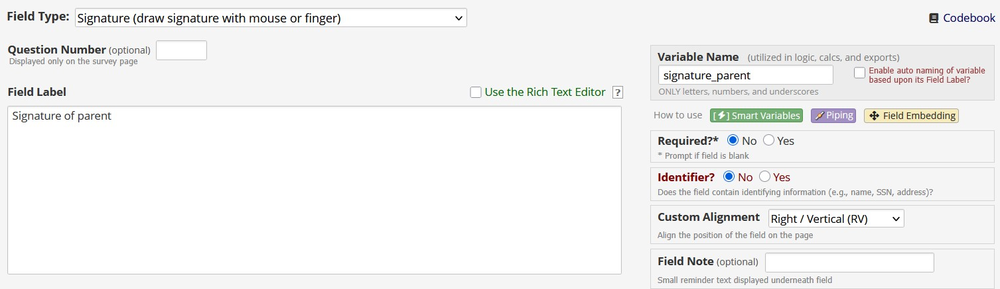{width=80%}

### File upload {#sec-designbas-variable-upload}

Surveys sometimes require an image or document to be uploaded. Either kind of file can be uploaded with a File Upload field. 
It looks a lot like a signature field when you are in the Online Designer.
There is an upload link at the bottom right that will be active when a survey is created.

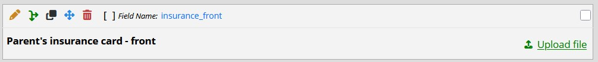{width=80%}

It also looks like a signature field when you are in the Edit Variable window, with similar options available.

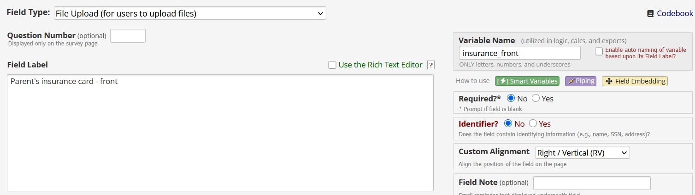{width=80%}

### Slider/Visual Analog Scale {#sec-designbas-slider}

Sometimes investigators like to ask questions on a survey that ask respondents to rate how they feel on a scale, such as 1 = Very unsatisfied to 7 = Very satisfied.
A Slider/Visual Analog Scale item allows the respondent to move a button on a slider from left to right and choose an answer. 
Here is what this kind of variable looks like in the Edit Field window.

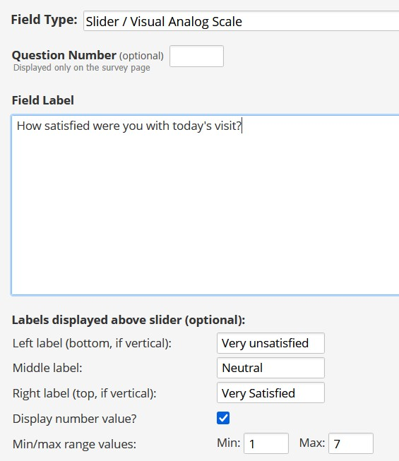{width=80%}

We have specified the lowest possible value is 1, and the highest possible value is 7, and we have provided anchors for the ends and the middle of the scale.
We also have selected the option allowing the respondent to see the number associated with the place on the scale where they move the button.
We can see the slider in Online Designer.

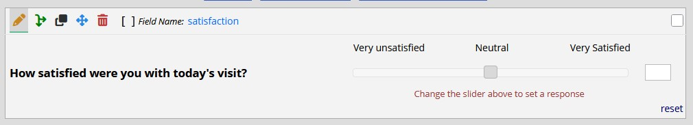{width=80%}

### Descriptive Text {#sec-designbas-descriptivetext}

A Descriptive Text field allows the REDCap project designer to add notes or images that do not collect any data. 
This kind of field can use HTML coding or rich-text editing (with the HTML hidden from you).
It also allows you to upload an image to appear in a survey.
Here is what an example Descriptive Text field looks like in Online Designer.

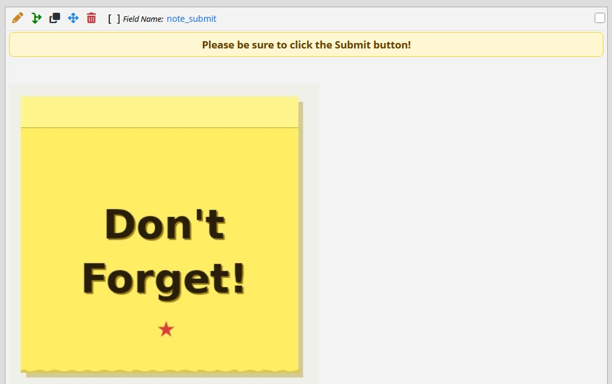{width=80%}

In the Edit Field window, you will see this item was created using HTML and image upload, with "inline" display chosen so that the image appears with the note written in HTML.

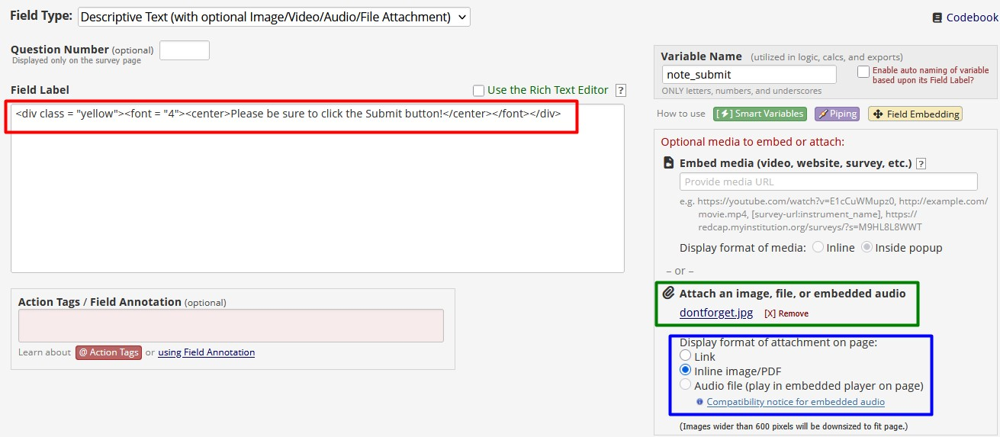{width=80%}

The image above shows a red box around the HTML, a green box where the image, file, or audio was attached, and the blood box shows we have selected "Inline image/PDF" so that the uploaded image appears with the HTML note.

### Begin New Section {#sec-designbas-beginnewsection}

The last option in the drop-down menu in the Edit Field window is Begin New Section. 
This option is available for REDCap users who are implementing a long online survey that needs to break occasionally and carry over to subsequent webpages.
We will not illustrate this option, as it is rarely used.

## Creating a new variable {#sec-designbas-variable-newvariables}

Our examples so far have shown variables that already existed in a REDCap
project.
Let's create a new variable. Look for the buttons that say "Add Field":

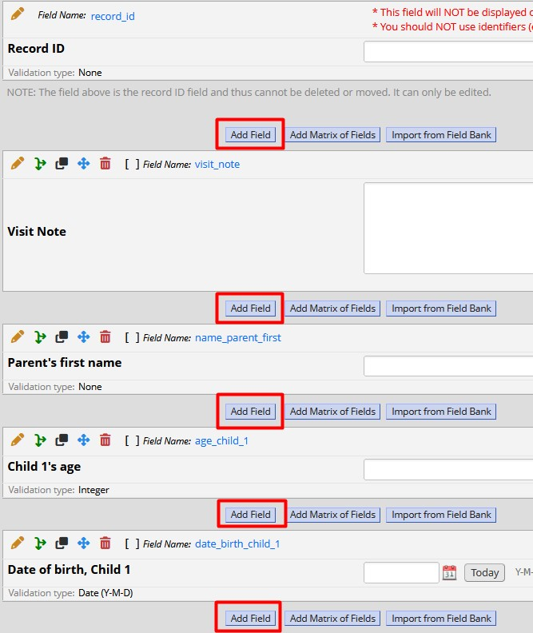{width=80%}

We can insert a field after any of the existing fields in the project by clicking one
of those buttons. Doing so opens a window called Add New Field. Let's create a field for
the best contact phone number:

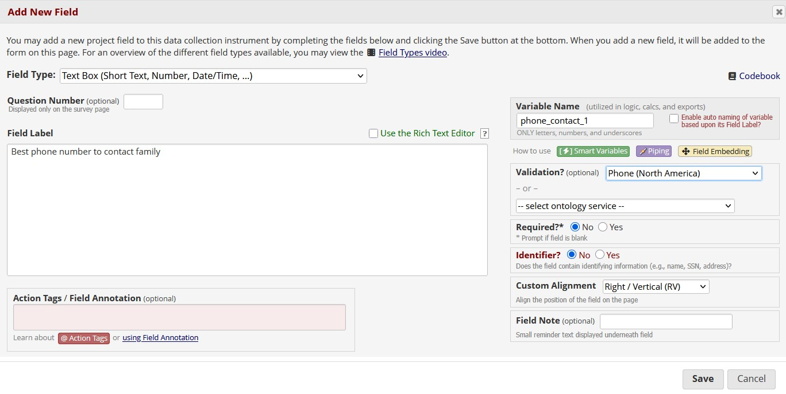{width=80%}

We named it phone_contact_1 to indicate it is the best number for contacting the family.
Then we click Save, and the new variable now appears on the form.
Note that we chose Phone (North America) as the Validation standard.
If someone enters a
phone number without an area code, an error message will say an invalid number was entered.

### Matrix of Fields {#sec-designbas-matrixoffields}

REDCap allows you to create a table that will hold many items similar to the slider field, except it has buttons and labels are possible for each rating.
This is called a *Matrix of Fields*.
It is created in a different way from the Add Variable button.
You click the "Add Matrix of Fields" button.
You get a window that asks you to name your table (matrix) of items.
Here is a matrix of fields as it appears in Online Designer.

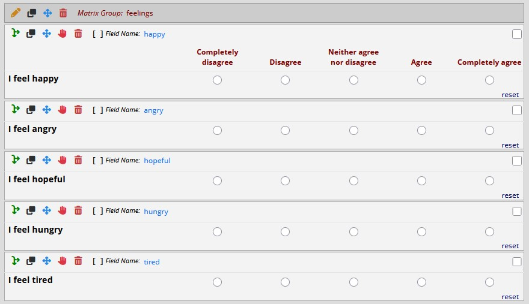{width=80%}

The matrix group is called feelings.
This group contains five items, each of which has a field name showing.
This is how the group will appear on a survey.
It requires entering the five response options as you would on a multiple-choice item, but the same response options are used for all items in the group.
You cannot have items in the same group requiring different labels on the scale.
Here is what the matrix group looks like in the Edit Field window.
The window had to be scrolled, so the screenshot is broken into two parts.

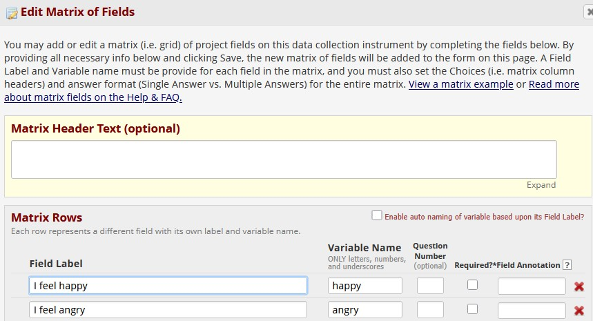{width=80%}

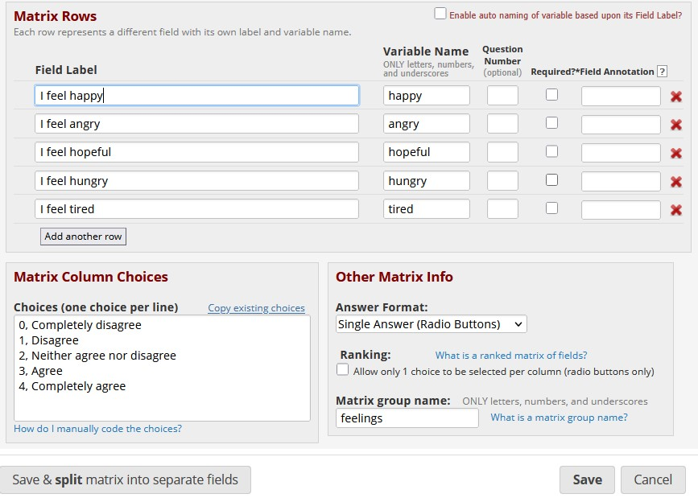{width=80%}

You can click on the *Add another row* button to add another item to the matrix.
Each item's responses will be saved in its own variable.

## Best Way to Learn {#sec-designbas-variable-howtolearn}

We recommend when you are learning about REDCap, request a practice project, then
go into Form 1, which gets created automatically.
A practice project is the best way to learn by doing.
Play around with creating different kinds of variables.
To request a practice project, click on My Projects in the top left corner of the page,
then click on the link at the top of the next page that says "+ New Project."
Fill out the form and a REDCap administrator will create a "Practice/Just For Fun"
project for you.
You will get an email when the project has been created and is available to you.

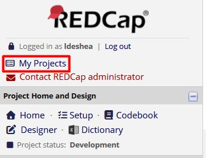{width=80%}

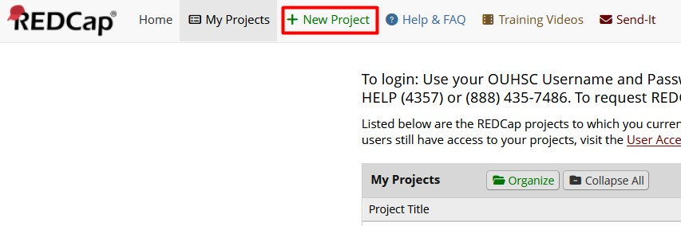{width=80%}

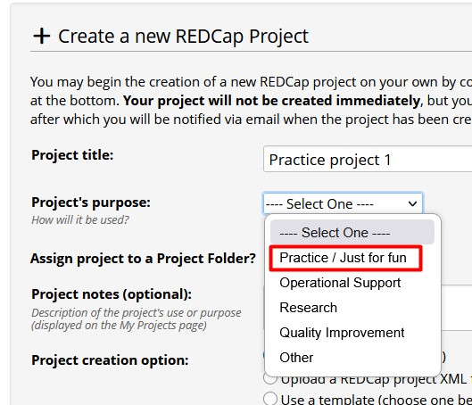{width=80%}

::: {.callout-note appearance="simple"}

## Additional Chapter Details

This chapter was last edited in April 2026.
If you have suggested modifications or additions, please see [How to Contribute](../index.qmd#sec-welcome-contribute) on the book's welcome page.
:::
