# Action Tags {#sec-designint-action}

<!--comment-->
<!--two # = 2nd level heading-->

**Chapter Leads**: Lise DeShea & Thomas Wilson

## Purpose {#sec-designint-action-purpose}

Action tags are used in REDCap to modify the appearance or behavior of items in a project.
They are added to the *Action Tags/Field Annotation* box under the Field Label in the Edit Field window for each variable.

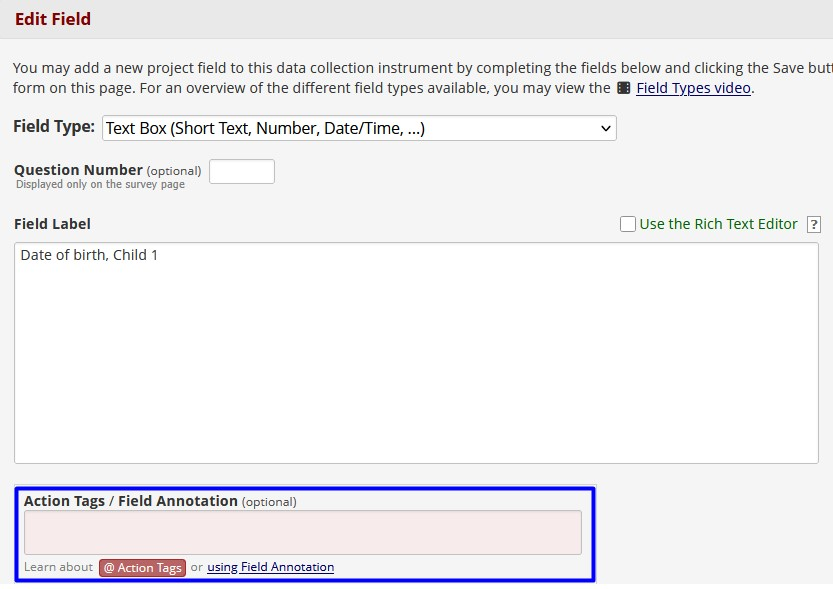{width=80%}

## Common {#sec-designint-action-common}

We will explain some of the more common action tags, then we will cover a few of the less common ones. We will start with a simple example.

### `@HIDEBUTTON` {#sec-designint-action-common-hide}

By default, date fields appear with a button labeled Today.
Clicking that button fills in today's date.
Sometimes a project designer does not want that button available.
A designer might want to force people reviewing past years' medical records to enter that date's year.
Every action tag begins with an at-sign, @.
The action tag to hide the Today button is `@HIDEBUTTON`.
When you click inside the Action Tags/Field Annotation box, it then opens another window, called the *Logic Editor.*

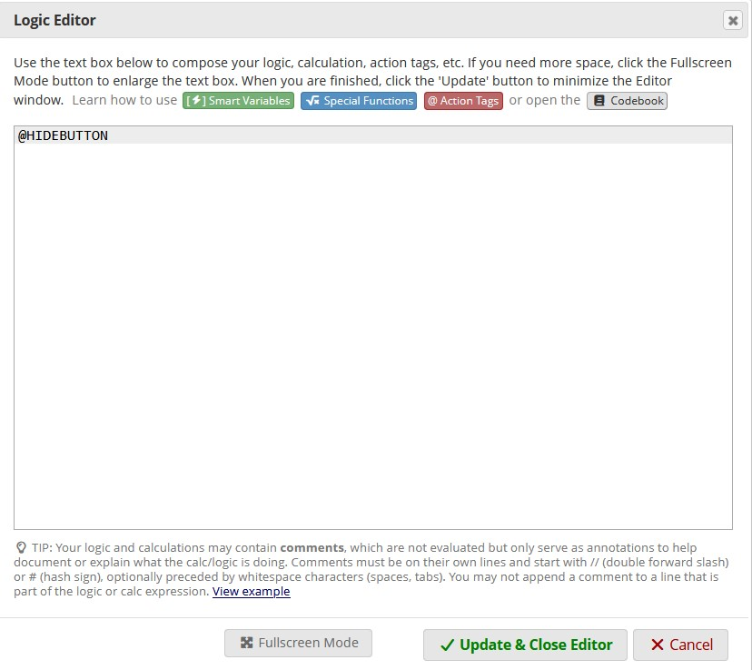{width=80%}

You can see that we have typed `@HIDEBUTTON` in the Logic Editor.
What if you cannot remember if this action tag has a hyphen in the middle?
You can click the red "@ Action Tags" button at the top of the Logic Editor and see a list of action tags and explanations.
To save this action tag, you click *Update & Close Editor*, then click the *Save* button on the Edit Field window.
Now the Today button no longer appears next to the date field.

### `@DEFAULT` {#sec-designint-action-common-default}

Sometimes a project designer can use an action tag to make things easier for the people doing data entry inside REDCap.
The action tag `@DEFAULT = '____'` can be used to set the starting value for a variable.
In this example, you would put a default value in the blank.
Let's say we expect most of the people in a study to be residents of Oklahoma.
We could set `@DEFAULT = 'OK'` so that Oklahoma shows up as the default state when a new record is created in REDCap.

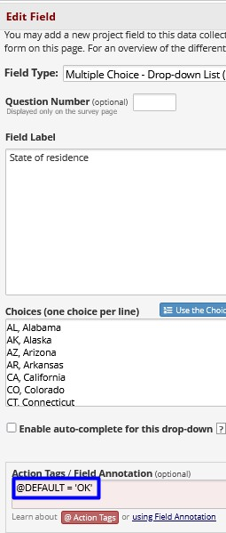{width=80%}

Notice that the value recorded in the data, OK, is the default value, not "Oklahoma," which is the label.
This action tag works only once, when the record is created.
If the data entry people or survey respondent needed to change it to Texas, they can use the drop-down menu to do so.
Their entry will not be overwritten with Oklahoma at a later time.
The default does not appear on the form you are creating in Online Designer.
It appears in a record, if you click the *Add/Edit Record* link on the left side of the screen and create a new record (see [Creating Records](../begin/create.md)).

### `@NONEOFTHEABOVE` {#sec-designint-action-common-none}

Let's say we have a REDCap project that allows people signing up for a conference to indicate their preferences for lunch.
We create a checkbox multiple-choice item where the respondents can indicate all of the acceptable options for lunch.
One option is none of the above.

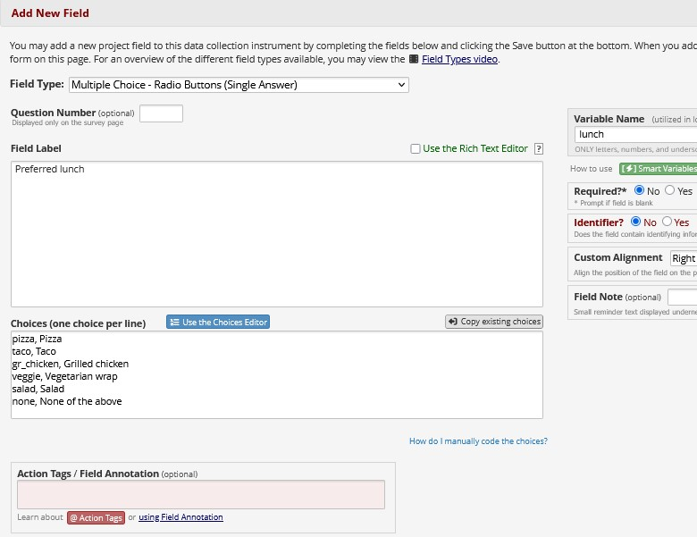{width=80%}

The `@NONEOFTHEABOVE` action tag will prevent a respondent who answers "None of the above" from checking any other lunch item.

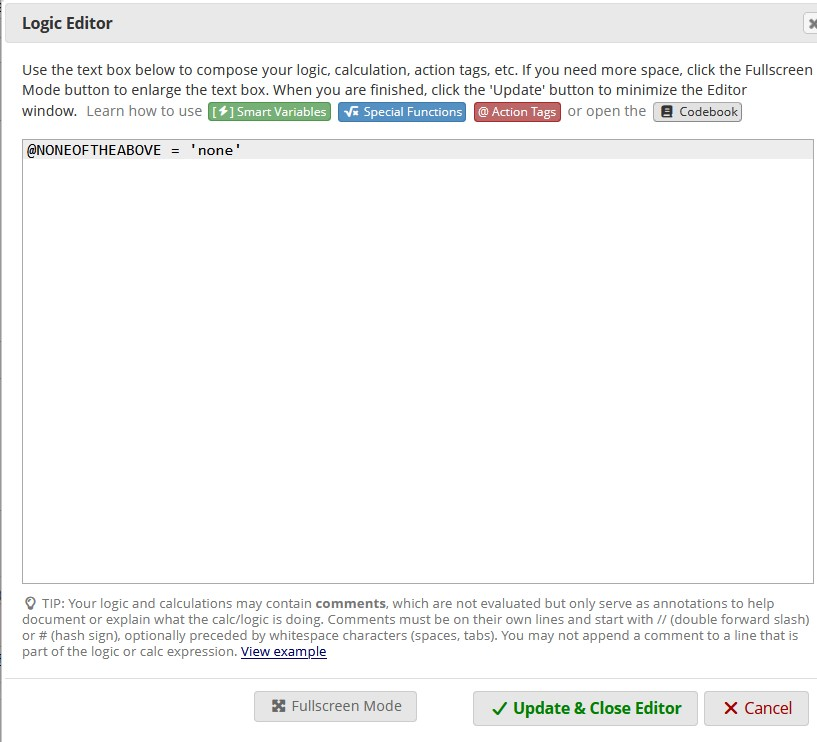{width=80%}

As we saw for the `@DEFAULT` action tag, the `@NONEOFTHEABOVE` action tag is followed by an equals sign, then the value recorded in the data, 'none' -- not the label "None of the above."
Generally speaking, when REDCap refers to character values like 'none,' the value is enclosed in single or double quotation marks.
When a numeric value is used to indicate "None of the above," then the number recorded in the data would follow the equals sign, without quotation marks.

### `@MAXCHECKED` {#sec-designint-action-common-maxchecked}

Suppose we do not want everyone to check every option in our list of lunch choices in this checkbox field.
We can use the `@MAXCHECKED` action tag to limit everyone to their top 2 or 3 preferences.
We can change the Field label to "Indicate your top 3 preferences for lunch."
Then we click on the Action Tags/Field Annotation box to open the Logic Editor, where we list this action tag.

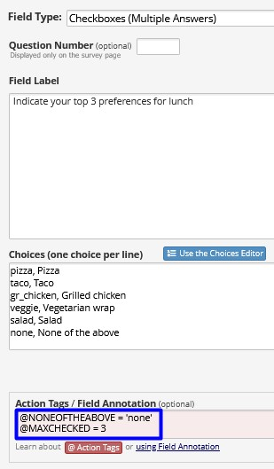{width=80%}

## Less Common {#sec-designint-action-lesscommon}

### `@SETVALUE` {#sec-designint-action-lesscommon-setvalue}

Sometimes we want to help out the data entry people by setting the value of a field.
A project may have a form especially for interviewing the first child in a family.
We can use `@SETVALUE` to specify the child being interviewed.

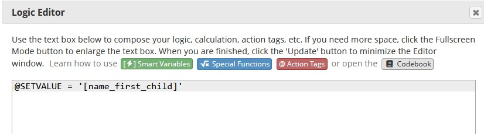{width=80%}

Let's say we have created a record for a family, and we have used Form 1 to enter some family information.
Now we want the first child's name to appear on the next form, which is being used to record data from interviewing Child 1.
We go into the family's record and click on the form for interviewing Child 1.
We will find Child 1's name, which was entered in the first form, automatically has been piped into this new form.

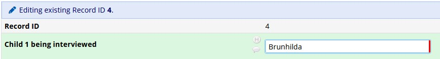{width=80%}

One caution: If you change the name that is piped into this field, it will revert to the piped-in value every time the record is opened. If you want to keep the data entry people from changing this value, you can use the next action tag.

### `@READONLY` {#sec-designint-action-lesscommon-readonly}

Adding the `@READONLY` action tag on the next line after `@SETVALUE = '[variablename]'` will make the field read-only for the data entry people.

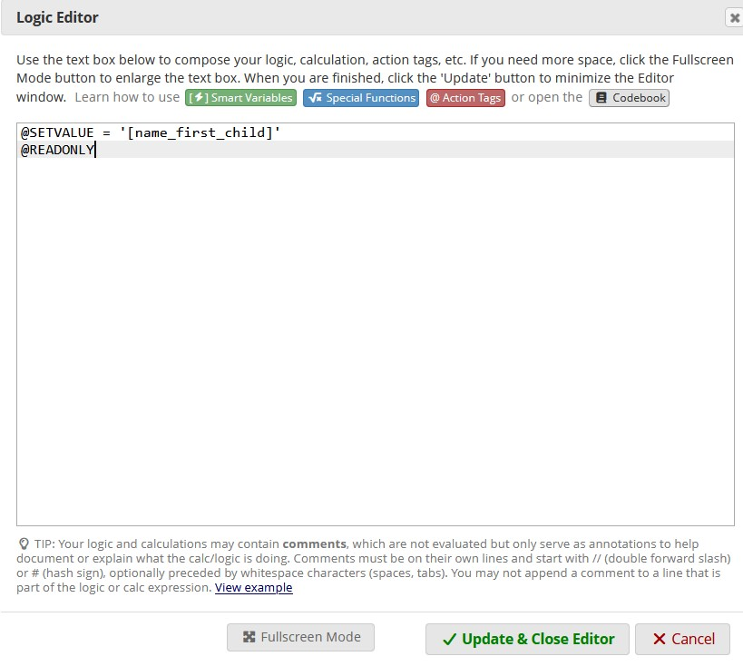{width=80%}

The child's name piped into the family's record will be in slightly gray font and cannot be edited.

### `@PLACEHOLDER` {#sec-designint-action-lesscommon-placeholder}

The `@PLACEHOLDER` action tag will not record any data.
It is used as a hint to the person filling out the form.
We might have a multiple-choice item with "Other" as one of the options.
If someone chooses Other, we may add a follow-up item asking for details.
We can create gray text to appear in the box for their answer, giving a hint about what to put in the box.
The words we want to appear in gray will be typed inside quotation marks after `@PLACEHOLDER = ` as shown below.

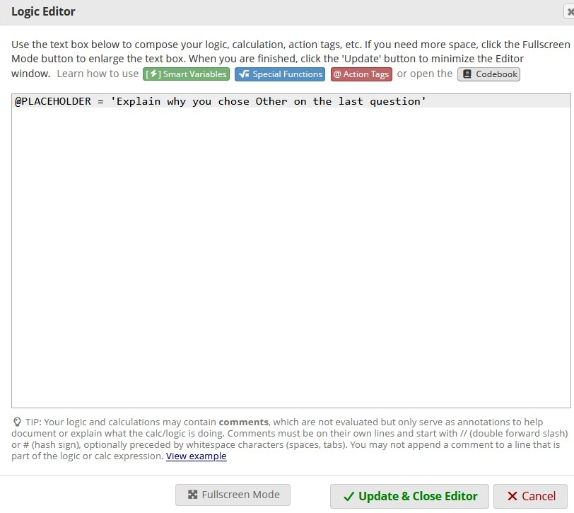{width=80%}

And here is what the result will look like. The words in this action tag are not saved as data.

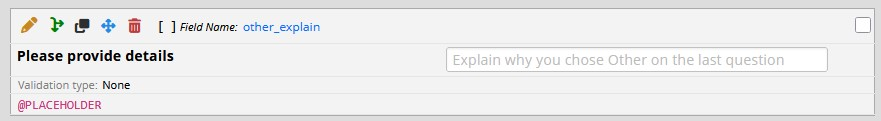{width=80%}

## Many Other Action Tags {#sec-designint-action-other}

If you have a specification that you would like to make in a form, there may be an action tag to help.
Just look through the available action tags by clicking on the red button inside the Logic Editor for action tags, clicking the link on the left side of the page in a REDCap project for *Help & FAQ*, or searching online.

::: {.callout-note appearance="simple"}

## Additional Chapter Details

This chapter was last edited in April 2026.
If you have suggested modifications or additions, please see [How to Contribute](../index.qmd#sec-welcome-contribute) on the book's welcome page.
:::
