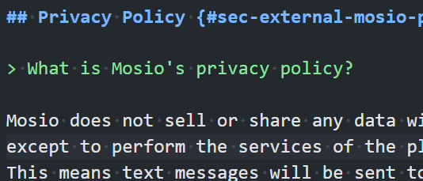

# Mosio {#sec-external-mosio}

**Chapter Leads**: Thomas Wilson

## Motivation & Overview {#sec-external-mosio-motivation}

In recent years, many researchers have found that texting is a productive channel for keeping in touch with participants,
either by itself or as a supplement to conventional communication.
[Mosio](https://www.mosio.com/) is a company that develops, supports, and licenses a product called
[REDCap Direct](https://www.mosio.com/redcap/).

{#fig-mosio-010-test fig-alt="Caption of Test Figure"}

The [REDCap Direct](https://www.mosio.com/redcap/) website provides a lot of current information
that we won't try to replicate in this manual.
Instead we'll outline when you might consider it,
and how to ask OU's [Server Administrators](../adminpr/user.md#sec-adminpr-user-role-ocri) for help establishing for your project.

## Pricing {#sec-external-mosio-pricing}

> How much does Mosio Cost?

Mosio offers several pricing plans tailored to different needs.
Outbound messages beyond what is listed below can be purchased at an addition price.
For exact pricing and to get a quote tailored to your specific needs, it's best to contact Mosio directly through their
[website](https://www.mosio.com/).

Here is a list of some of the details:

### Basic Plan {#sec-external-mosio-pricing-basic}

* Projects: Up to 4
* Outbound Messages: 1,000 per month

### Plus Plan {#sec-external-mosio-pricing-plus}

* Projects: Up to 10
* Outbound Messages: 3,000 per month

### Pro Plan {#sec-external-mosio-pricing-pro}

* Projects: Up to 30
* Outbound Messages: 7,500 per month

## Access {#sec-external-mosio-access}

> How do I get access to Mosio?

To connect Mosio with REDCap, follow these steps:

1. Set Up Your REDCap Project:

   * Log into REDCap and create a new project.
   * Define your variables using the Data Dictionary or Online Designer.
   * Design your survey and enable surveys under the 'Project Setup' tab.

1. Mosio Account Setup:

   * Ensure you have a Mosio account.
   * Log into your Mosio dashboard and navigate to the integration settings.

1. API Configuration:

   * In REDCap, go to the 'External Modules' section and enable the Mosio module.
   * Enter your Mosio API credentials to link the two platforms.

1. Configure Messaging:

   * Define the messaging parameters within Mosio.
   * Set up various types of messages, such as survey invitations, reminders, and follow-ups

This integration allows you to send automated text messages to participants, improving engagement and data collection. If you need more detailed instructions, you can refer to the
[Mosio REDCap Direct guide](https://mosio.zendesk.com/hc/en-us/articles/19320839259789-Mosio-REDCap-Direct-How-to-Configure-REDCap-to-send-SMS-through-Mosio).

## Limitations {#sec-external-mosio-limitation}

> What are the limitations of using Mosio?

Using Mosio for text messaging in clinical trials and other applications has several limitations:

1. Message Length:
  Text messages are limited to 160 characters,
  which can restrict the amount of information that can be conveyed in a single message.

1. User Engagement:
  Not all participants may be comfortable or familiar with text messaging,
  potentially leading to lower engagement rates.

1. Data Privacy:
  Ensuring the privacy and security of sensitive information transmitted via text messages can be challenging.
  While the transmission utilizing Mosio with REDCap is secure,
  you cannot ensure the security of the message when it reaches the recipient's phone.

1. Cost:
  Depending on the volume of messages sent, the cost of using Mosio can add up,
  especially for large-scale studies.

Despite these limitations,
Mosio remains a valuable tool for improving participant engagement and data collection in various settings.
If you have any specific concerns or need help with a particular aspect, feel free to ask!

## Message Types {#sec-external-mosio-messagetypes}

> What types of messages can I send with Mosio?

With Mosio, you can send a variety of messages to enhance participant engagement and data collection. Here are some types of messages you can send:

1. Survey Invitations:
  Send links to surveys or questionnaires directly to participants' mobile phones.

1. Reminders:
  Schedule automated reminders for appointments, medication adherence, or survey completions.

1. Alerts and Notifications:
  Notify participants about important updates or actions they need to take.

1. Compliance Confirmations:
  Request participants to confirm they have completed a specific action.

1. Automated Messaging (Storylines):
  Set up automated sequences of messages for interventions, follow-ups, and engagement.

1. Incentives and Gift Codes:
  Send participants incentives or gift codes as part of your study.

## After Approval {#sec-external-mosio-afterapproval}

> I have approval and am ready to use Mosio. What is the next step?

{Thomas will write this paragraph, and will be bugged by Vignesh & James every two weeks until he does.}

## Sending Messages {#sec-external-mosio-sendingmessages}

> How do I send Mosio messages in REDCap?

To send Mosio messages in REDCap, follow these steps:

1. Enable Mosio Module in REDCap:

   * Go to the 'External Modules' section in your REDCap project.
   * Find and enable the Mosio module.

1. Configure Mosio Settings:

   * Enter your Mosio API credentials in the module settings.
     (This is done by the REDCap admin.)

   * Configure the messaging parameters,
    such as sender ID and message templates.

1. Set Up Survey Invitations:

   * In the 'Survey Distribution Tools' section,
     select 'SMS' as the distribution method.
   * Enter the participants' phone numbers and customize the invitation message.

1. Schedule Alerts and Notifications:

   * Use the 'Alerts & Notifications' feature to schedule automated messages.
   * Define the conditions under which messages should be sent
     (e.g., survey completion reminders).

1. Automated Messaging:

   * Set up automated messaging sequences.
     (Storylines) for interventions or follow-ups.
   * Configure the timing and content of each message in the sequence.

For detailed instructions, you can refer to the
[Mosio REDCap Direct guide](https://mosio.zendesk.com/hc/en-us/articles/19320839259789-Mosio-REDCap-Direct-How-to-Configure-REDCap-to-send-SMS-through-Mosio)

If you encounter any specific issues or need further assistance, feel free to ask!

## Monitoring Usage {#sec-external-mosio-monitoring}

> How can I monitor my Mosio usage?

To monitor your Mosio usage, you can use the following methods:

1. Dashboard Overview:

   * Log into your Mosio account and access the dashboard.
   * The dashboard provides a summary of your messaging activity, including the number of messages sent, received, and scheduled.

1. Storylines Monitoring:

   * Use the Storylines module to track the progress of automated messaging sequences.
   * In the Monitor section, you can view the real-time status of message history, survey completions, and participant engagement.

1. Message History:

   * Access the message history to see detailed logs of all messages sent and received.
   * This includes timestamps, message content, and participant responses.

1. Usage Reports:

   * Generate usage reports to get a comprehensive view of your messaging activity over a specific period.
   * These reports can help you analyze trends and optimize your communication strategy.

1. Alerts and Notifications:

   * Set up alerts and notifications to receive updates on key metrics, such as message delivery rates and participant responses

For more detailed instructions, you can refer to the
[Mosio Training Guides](https://www.mosio.com/t/).

## Usage Examples {#sec-external-mosio-examples}

> What are some examples of using Mosio?

People are using Mosio in REDCap for various purposes to enhance their research projects. Here are some common uses:

1. Survey Distribution:

   * Researchers send survey invitations via text message,
   ensuring participants receive timely reminders and links to complete surveys.

1. Automated Reminders:

   * Automated reminders are set up to nudge participants to complete surveys,
   attend appointments, or adhere to study protocols.

1. Data Collection:

   * Text messages are used to collect data directly from participants,
   which can then be automatically imported into REDCap.

1. Intervention Campaigns:

   * Researchers deploy text-based interventions, such as health tips or motivational messages, to improve participant outcomes.

1. Incentives and Rewards:

   * Participants receive gift codes or other incentives via text message for completing surveys or other study tasks.

These features help streamline communication, improve participant engagement,
and enhance data collection efficiency.
If you have a specific use case in mind, feel free to share,
and I can provide more detailed guidance!

## Privacy Policy {#sec-external-mosio-privacy}

> What is Mosio's privacy policy?

Mosio does not sell or share any data with third parties,
except to perform the services of the platform.
This means text messages will be sent to mobile carriers
so they can be delivered to the participants' phones.
Emails will also route through our email providers.
Mosio only works with vendors who also do not resell any information.
The full details are in the
[Mosio privacy policy](https://www.mosio.com/privacy/).

::: {.callout-note appearance="simple"}

## Additional Chapter Details

This chapter was started in October 2024.
If you have suggested modifications or additions, please see [How to Contribute](../index.qmd#sec-welcome-contribute) on the book's welcome page.
:::
